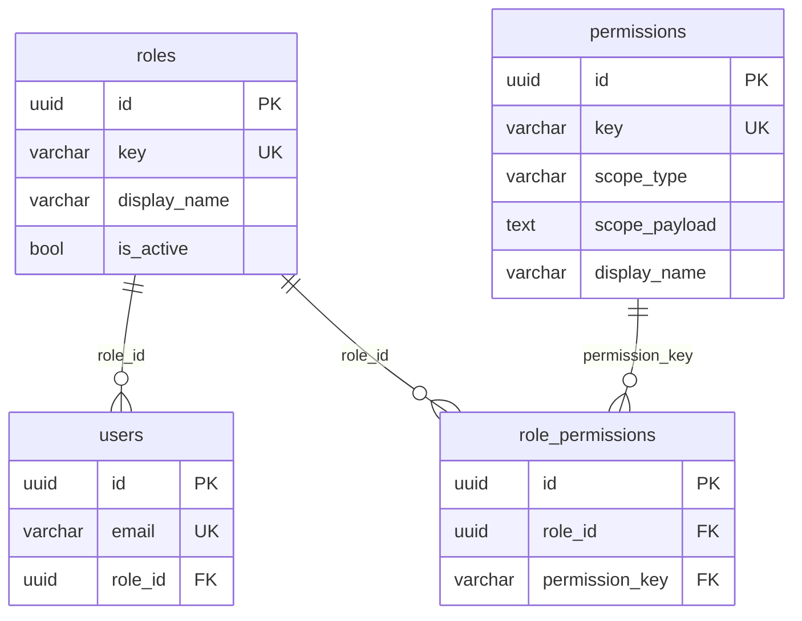

# YepPet - Esquema BBDD (E/R)

Aquest document resumeix l'esquema de base de dades actual (Entity Framework snapshot), amb focus en entitats, relacions i la part d'autenticacio/autoritzacio.

## Idea clau: rol vs permis

- `roles`: cataleg de rols (taula dedicada).
- `users.role_id`: rol assignat a cada usuari.
- `permissions`: cataleg de permisos (clau, nom visible, ambit, descripcio...).
- `role_permissions`: taula pont que assigna permisos als rols (`role_id` + `permission_key`).

Model objectiu: rols amb FK reals a BD (sense strings solts per rol).

## Esquema de permisos + rols (objectiu)



## Diagrama entitat-relacio (Mermaid)

```mermaid
erDiagram
    users ||--|| favorite_lists : "owner_user_id"
    users ||--o{ place_reviews : "author_user_id"
    users ||--o{ privacy_consent_events : "user_id"

    favorite_lists ||--o{ favorite_entries : "favorite_list_id"
    places ||--o{ favorite_entries : "place_id"

    places ||--o{ place_reviews : "place_id"
    places ||--o{ place_features : "place_id"
    features ||--o{ place_features : "feature_id"
    places ||--o{ place_tags : "place_id"
    tags ||--o{ place_tags : "tag_id"

    permissions ||--o{ role_permissions : "permission_key -> permissions.key"
    menus ||--o{ menu_roles : "menu_key -> menus.key"
    menus ||--o{ menus : "parent_key -> menus.key"

    countries ||--o{ cities : "country_id"

    users {
        uuid id PK
        varchar email UK
        varchar password_hash
        varchar role
        bool privacy_accepted
        timestamptz created_at_utc
    }

    permissions {
        uuid id PK
        varchar key UK
        varchar scope_type
        text scope_payload
        varchar display_name
        varchar description
        timestamptz created_at_utc
        timestamptz updated_at_utc
    }

    role_permissions {
        uuid id PK
        varchar role
        varchar permission_key FK
        UK "role + permission_key"
    }

    menus {
        uuid id PK
        varchar key UK
        varchar label
        varchar route
        varchar parent_key FK
        int sort_order
        bool is_active
    }

    menu_roles {
        uuid id PK
        varchar menu_key FK
        varchar role
        UK "menu_key + role"
    }

    places {
        uuid id PK
        varchar name
        varchar type
        numeric latitude
        numeric longitude
        numeric rating_average
        int review_count
    }

    place_reviews {
        uuid id PK
        uuid place_id FK
        uuid author_user_id FK
        int score
        text comment
        bool is_visible
        timestamptz created_at_utc
    }

    features {
        uuid id PK
        varchar code UK
        varchar display_name
    }

    tags {
        uuid id PK
        varchar code UK
        varchar display_name
    }

    place_features {
        uuid place_id FK
        uuid feature_id FK
        PK "place_id + feature_id"
    }

    place_tags {
        uuid place_id FK
        uuid tag_id FK
        PK "place_id + tag_id"
    }

    favorite_lists {
        uuid id PK
        uuid owner_user_id FK_UK
    }

    favorite_entries {
        uuid id PK
        uuid favorite_list_id FK
        uuid place_id FK
        timestamptz saved_at_utc
        UK "favorite_list_id + place_id"
    }

    privacy_consent_events {
        uuid id PK
        uuid user_id FK
        bool accepted
        varchar source
        timestamptz registered_at_utc
    }

    countries {
        uuid id PK
        varchar code UK
        varchar name
        int sort_order
        bool is_active
    }

    cities {
        uuid id PK
        uuid country_id FK
        varchar name
        varchar normalized_name
        int sort_order
        bool is_active
        UK "country_id + normalized_name"
    }
```

## Flux de permisos (resum funcional)

1. Crear permis nou -> s'insereix una fila a `permissions`.
2. Segons `scope_type`, es desa contingut addicional a `permissions.scope_payload`:
   - `menu` -> claus de menú seleccionades
   - `page` -> URL de la pàgina objectiu
   - `action` -> `null` de moment (reservat per evolució futura)
3. Assignar aquest permis a rols -> s'insereixen files a `role_permissions` (`role`, `permission_key`).
4. Quan un usuari inicia sessio, el seu `users.role` determina quines claus de `role_permissions` rep efectivament.

## Notes de disseny

- Ponts N:M:
  - `place_features` entre `places` i `features`.
  - `place_tags` entre `places` i `tags`.
  - `role_permissions` entre rols logics i `permissions`.
  - `menu_roles` entre rols logics i `menus`.
- Jerarquia de menus per autoreferencia: `menus.parent_key -> menus.key`.
- Integritat:
  - claus uniques de cataleg (`permissions.key`, `menus.key`, `tags.code`, `features.code`, `countries.code`, etc.).
  - restriccions a `places` i `place_reviews` (rang score/rating, review_count no negatiu, etc.).
- `permissions.scope_payload` es tracta com a JSON lògic de domini, encara que físicament sigui `text`.
