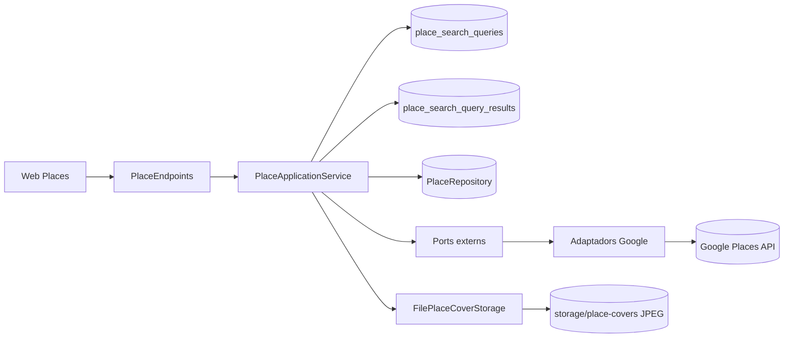

# Document tecnic (CA)

## 1. Introduccio

Aquest document descriu com esta construida **Zuppeto** a nivell tecnic.
En l'estat actual, el projecte es una web Angular 22 connectada a un backend `.NET`, arquitectura per `features`
i una primera base funcional de mapa amb `Leaflet` i `OpenStreetMap`.

Objectius:

- documentar l'arquitectura actual del frontend
- deixar traçabilitat de components, serveis i decisions tecniques
- explicar el model de dades actual
- descriure la base d'autenticacio real i control d'acces
- descriure la implementacio del mapa
- deixar traçabilitat del domini backend que obre la Fase III
- deixar una base UML tecnica clara i mantenible
- documentar la infraestructura de missatgeria (`RabbitMQ`) quan quedi preparada al repositori

## 2. Esquema tecnic general

<pre style="background:#020617; color:#e5eef7; border:1px solid #1e293b; border-radius:16px; padding:20px; margin:16px 0; overflow:auto; line-height:1.65;"><code><span style="color:#5eead4; font-weight:700;">flowchart LR</span>
  <span style="color:#93c5fd;">U[Usuari]</span> --&gt;|<span style="color:#fcd34d;">Navegador</span>| <span style="color:#c4b5fd;">W[Zuppeto Web Angular]</span>
  <span style="color:#c4b5fd;">W</span> --&gt;|<span style="color:#fca5a5;">HTTP real</span>| <span style="color:#86efac;">API[(Zuppeto Api)]</span>
  <span style="color:#c4b5fd;">W</span> --&gt;|<span style="color:#fcd34d;">Mapa</span>| <span style="color:#67e8f9;">MAP[Leaflet + OpenStreetMap]</span>

  <span style="color:#5eead4; font-weight:700;">subgraph</span> <span style="color:#f9a8d4;">FE[Frontend Angular]</span>
    <span style="color:#93c5fd;">C[core]</span>
    <span style="color:#93c5fd;">S[shared]</span>
    <span style="color:#93c5fd;">F[features]</span>
  <span style="color:#5eead4; font-weight:700;">end</span>

  <span style="color:#c4b5fd;">W</span> --&gt; <span style="color:#93c5fd;">F</span>
  <span style="color:#93c5fd;">F</span> --&gt; <span style="color:#93c5fd;">C</span>
  <span style="color:#93c5fd;">F</span> --&gt; <span style="color:#93c5fd;">S</span>
  <span style="color:#93c5fd;">F</span> --&gt; <span style="color:#86efac;">API</span>
  <span style="color:#93c5fd;">F</span> --&gt; <span style="color:#67e8f9;">MAP</span></code></pre>

Resum del diagrama:

- la web Angular es el punt d'entrada de l'usuari
- la logica es distribueix per `features`
- `core` conté peces globals i `shared` peces reutilitzables
- els fluxos principals del frontend ja treballen contra API real
- el mapa es tracta com una capacitat transversal reutilitzable

## 2.1 Estat tecnic actual

En aquest moment conviuen dues capes amb rols diferents:

- un frontend Angular 22 que continua sent la base executable del producte
- un backend `.NET` complet a `Domain`, `Application`, `Infrastructure` i `Api`, ja integrat amb la web per als fluxos principals

Aixo vol dir que:

- la UI ja consumeix backend real per `places`, `favorites`, manteniment de `perfil` i autenticació
- la persistencia real ja esta implementada
- el login propi ja passa per `Api` i la federacio Google ja queda disponible en `Development`
- pero el model de domini ja no depen del model fake del frontend
- el backend comenca pel domini i no per la base de dades
- el domini continua separat de la persistencia ORM encara que `Entity Framework` ja estigui muntat a `Infrastructure`

### 2.1.1 Frontend Angular 22

Migració des d’Angular 21 amb `ng update` (paquet local `@angular/core` **22.1.1**, CLI **22.1.3**, TypeScript **~6.0.3**):

- els components existents porten `changeDetection: ChangeDetectionStrategy.Eager` (a v22 el defecte nou és `OnPush`)
- `provideHttpClient(withXhr())` conserva el backend XHR (a v22 el defecte és Fetch)
- `paramsInheritanceStrategy: 'emptyOnly'` a `app.config.ts` conserva el comportament del router pre-v22
- Node.js mínim: **22+** (alineat amb l’entorn local)

**Punt estable `068`:** aquest commit (Angular 22, `ZUPPETO_BUILD_ROOT` al Docker, F5 amb Chrome Flatpak Swagger+Web, fix migració menús) queda com a baseline **funcional** validada a l’entorn de desenvolupament Fedora/Cursor.

## 2.2 Base backend oberta a Fase III

La Fase III s'ha obert amb una primera capa `Domain` a:

```text
src/Backend/Domain
```

Peces creades:

- `Domain.csproj`
- base comuna `Entity`, `AggregateRoot`, `ValueObject` i `DomainRuleException`
- agregats `Place`, `User`, `FavoriteList`, `PlaceReview`
- `value objects` per adreca, geolocalitzacio, politica pet, preu, rating, perfil i consentiment
- contractes de repositori com a abstraccions
- solucio `__Zuppeto_sln__` per carregar el backend al workspace i a l'editor

Decisio tecnica clau:

- el domini s'ha començat abans que `PostgreSQL`, `Entity Framework` o API
- la persistencia s'ha d'adaptar al domini
- el frontend actual segueix sent referència funcional, pero no dicta la forma final de persistencia

## 2.3 Base de dades de desenvolupament

Per poder treballar el model relacional sense dependre d'una instal·lacio manual local, el repo incorpora ja una base de dades de desenvolupament amb `Docker`.

Peces creades:

- `docker-compose.yml`
- `.env.example`
- carpeta `sql/init/` reservada per bootstrap mínim no governat per ORM
- port extern `5433` per conviure amb altres stacks locals que ja usen `5432`
- fitxers `sql/init/*` reduits a suport de bootstrap i no a creacio de schema

<pre style="background:#020617; color:#e5eef7; border:1px solid #1e293b; border-radius:16px; padding:20px; margin:16px 0; overflow:auto; line-height:1.65;"><code><span style="color:#5eead4; font-weight:700;">flowchart LR</span>
  <span style="color:#93c5fd;">DEV[Desenvolupament local]</span> --&gt; <span style="color:#c4b5fd;">DC[docker-compose.yml]</span>
  <span style="color:#c4b5fd;">DC</span> --&gt; <span style="color:#86efac;">PG[(PostgreSQL 17 :5433 extern)]</span>
  <span style="color:#c4b5fd;">DC</span> --&gt; <span style="color:#fcd34d;">ENV[Variables .env]</span>
  <span style="color:#86efac;">PG</span> --&gt; <span style="color:#f9a8d4;">SQL[sql/init]</span>
  <span style="color:#f9a8d4;">SQL</span> --&gt; <span style="color:#a7f3d0;">SCH[Schema real creat]</span></code></pre>

Resum del diagrama:

- el desenvolupament local arrenca la BBDD a traves de `docker-compose`
- la configuracio sensible queda externalitzada a variables d'entorn
- `sql/init` queda reservada per bootstrap auxiliar i no per crear l'esquema principal
- la BBDD es un suport operatiu del punt actual, no el centre de l'arquitectura
- el port `5433` evita conflictes amb altres repos locals que ja fan servir `5432`
- la validacio del contenidor confirma que la base de dades local de `Zuppeto` ja esta operativa
- l'esquema real ja queda governat per migracions d'`Entity Framework`

## 2.4 Persistencia ORM en Infrastructure

La implementacio base d'`Entity Framework` ja queda consolidada a `src/Backend/Infrastructure` sense contaminar el domini.

Peces creades:

- `DependencyInjection.cs`
- `Persistence/__ZuppetoDbContext__.cs`
- `Persistence/__ZuppetoDbContext__Factory.cs`
- `Persistence/Entities/*`
- `Persistence/Configurations/*`
- `Persistence/Migrations/*`
- `dotnet-tools.json` per fixar `dotnet-ef` 10 al repo

Decisio tecnica clau:

- no es mapegen directament els agregats de domini a EF
- `Infrastructure` manté models de persistencia propis
- el domini continua net de dependències ORM
- la creacio d'esquema es governa per migracions EF i no per SQL manual
- el mapping domini <-> persistencia queda reservat per al punt de mapatges i repositoris
- aquest mapping es fara manualment i per agregat, sense `AutoMapper`

<pre style="background:#020617; color:#e5eef7; border:1px solid #1e293b; border-radius:16px; padding:20px; margin:16px 0; overflow:auto; line-height:1.65;"><code><span style="color:#5eead4; font-weight:700;">flowchart LR</span>
  <span style="color:#93c5fd;">DOM[Domain]</span> -.-> <span style="color:#c4b5fd;">APP[Application]</span>
  <span style="color:#c4b5fd;">APP</span> -.-> <span style="color:#86efac;">INF[Infrastructure]</span>
  <span style="color:#86efac;">INF</span> --&gt; <span style="color:#fcd34d;">CTX[__ZuppetoDbContext__]</span>
  <span style="color:#fcd34d;">CTX</span> --&gt; <span style="color:#f9a8d4;">CFG[EF Configurations]</span>
  <span style="color:#fcd34d;">CTX</span> --&gt; <span style="color:#67e8f9;">REC[Persistence Records]</span>
  <span style="color:#fcd34d;">CTX</span> --&gt; <span style="color:#a7f3d0;">PG[(PostgreSQL :5433)]</span>
  <span style="color:#fcd34d;">CTX</span> --&gt; <span style="color:#fde68a;">MIG[EF Migrations]</span>
  <span style="color:#86efac;">INF</span> -.-> <span style="color:#fca5a5;">MAP[Manual Aggregate Mappers]</span></code></pre>

Resum del diagrama:

- `Entity Framework` queda encapsulat dins de `Infrastructure`
- `DbContext`, configuracions i records de persistencia viuen fora del domini
- les migracions passen a ser la font de veritat de l'esquema
- l'arquitectura continua coherent amb `DDD` i evita acoblar negoci i ORM
- el següent tram ja no és muntar EF, sinó mapar domini i implementar repositoris
- el mapatge serà manual per agregat per mantenir control explícit sobre `value objects`, col·leccions i regles de conversió

## 2.5 Estrategia de mapatge i repositoris

Per al punt actiu, el backend treballara amb aquesta estrategia:

- un mapper manual per agregat
- mappers ubicats a `Infrastructure/Persistence/Mappings`
- repositoris EF a `Infrastructure/Persistence/Repositories`
- cada repositori utilitza `__ZuppetoDbContext__` + mapper del seu agregat
- el domini no coneix ni EF ni els records de persistencia

Distribucio prevista:

- `PlacePersistenceMapper`
- `UserPersistenceMapper`
- `FavoriteListPersistenceMapper`
- `PlaceReviewPersistenceMapper`

<pre style="background:#020617; color:#e5eef7; border:1px solid #1e293b; border-radius:16px; padding:20px; margin:16px 0; overflow:auto; line-height:1.65;"><code><span style="color:#5eead4; font-weight:700;">flowchart LR</span>
  <span style="color:#93c5fd;">REP[EF Repository]</span> --&gt; <span style="color:#c4b5fd;">CTX[__ZuppetoDbContext__]</span>
  <span style="color:#93c5fd;">REP</span> --&gt; <span style="color:#86efac;">MAP[Aggregate Mapper]</span>
  <span style="color:#86efac;">MAP</span> --&gt; <span style="color:#fcd34d;">DOM[Aggregate Domain]</span>
  <span style="color:#86efac;">MAP</span> --&gt; <span style="color:#f9a8d4;">REC[Persistence Record]</span>
  <span style="color:#c4b5fd;">CTX</span> --&gt; <span style="color:#67e8f9;">DB[(PostgreSQL)]</span></code></pre>

Resum del diagrama:

- el repositori EF coordina lectura i escriptura
- el mapper transforma entre agregat de domini i model de persistencia
- la conversio es explícita i no amagada en eines automàtiques
- aquesta via facilita mantenir `DDD` i controlar millor l'evolucio dels `value objects`

## 2.6 Estat tancat de mapatge i repositoris

Aquest punt ja queda completat dins de `Infrastructure`.

Peces creades:

- `Persistence/Mappings/PlacePersistenceMapper.cs`
- `Persistence/Mappings/UserPersistenceMapper.cs`
- `Persistence/Mappings/FavoriteListPersistenceMapper.cs`
- `Persistence/Mappings/PlaceReviewPersistenceMapper.cs`
- `Persistence/Repositories/PlaceRepository.cs`
- `Persistence/Repositories/UserRepository.cs`
- `Persistence/Repositories/FavoriteListRepository.cs`
- `Persistence/Repositories/PlaceReviewRepository.cs`

<pre style="background:#020617; color:#e5eef7; border:1px solid #1e293b; border-radius:16px; padding:20px; margin:16px 0; overflow:auto; line-height:1.65;"><code><span style="color:#5eead4; font-weight:700;">flowchart LR</span>
  <span style="color:#93c5fd;">IPlaceRepository</span> --&gt; <span style="color:#c4b5fd;">PlaceRepository</span>
  <span style="color:#93c5fd;">IUserRepository</span> --&gt; <span style="color:#c4b5fd;">UserRepository</span>
  <span style="color:#93c5fd;">IFavoriteListRepository</span> --&gt; <span style="color:#c4b5fd;">FavoriteListRepository</span>
  <span style="color:#93c5fd;">IPlaceReviewRepository</span> --&gt; <span style="color:#c4b5fd;">PlaceReviewRepository</span>
  <span style="color:#c4b5fd;">PlaceRepository</span> --&gt; <span style="color:#86efac;">PlacePersistenceMapper</span>
  <span style="color:#c4b5fd;">UserRepository</span> --&gt; <span style="color:#86efac;">UserPersistenceMapper</span>
  <span style="color:#c4b5fd;">FavoriteListRepository</span> --&gt; <span style="color:#86efac;">FavoriteListPersistenceMapper</span>
  <span style="color:#c4b5fd;">PlaceReviewRepository</span> --&gt; <span style="color:#86efac;">PlaceReviewPersistenceMapper</span>
  <span style="color:#c4b5fd;">PlaceRepository</span> --&gt; <span style="color:#fcd34d;">__ZuppetoDbContext__</span>
  <span style="color:#c4b5fd;">UserRepository</span> --&gt; <span style="color:#fcd34d;">__ZuppetoDbContext__</span>
  <span style="color:#c4b5fd;">FavoriteListRepository</span> --&gt; <span style="color:#fcd34d;">__ZuppetoDbContext__</span>
  <span style="color:#c4b5fd;">PlaceReviewRepository</span> --&gt; <span style="color:#fcd34d;">__ZuppetoDbContext__</span></code></pre>

Resum del diagrama:

- cada contracte de domini ja te una implementacio EF concreta
- cada repositori depen del seu mapper i del `DbContext`
- el punt queda tancat sense trencar la separacio entre domini i infraestructura
- el següent pas ja és pujar de nivell cap al backend `.NET` i els casos d'ús

## 2.7 Estat tancat del backend `.NET`

El backend `.NET` ja queda estructurat amb les quatre capes base:

- `Domain`
- `Application`
- `Infrastructure`
- `Api`

Peces creades a `Application`:

- `DependencyInjection.cs`
- serveis d'aplicacio per `places`, `favorites`, `users` i `reviews`
- DTOs/contractes d'entrada i sortida

<pre style="background:#020617; color:#e5eef7; border:1px solid #1e293b; border-radius:16px; padding:20px; margin:16px 0; overflow:auto; line-height:1.65;"><code><span style="color:#5eead4; font-weight:700;">flowchart LR</span>
  <span style="color:#93c5fd;">API[Api]</span> --&gt; <span style="color:#c4b5fd;">APP[Application]</span>
  <span style="color:#c4b5fd;">APP</span> --&gt; <span style="color:#86efac;">DOM[Domain]</span>
  <span style="color:#c4b5fd;">APP</span> --&gt; <span style="color:#fcd34d;">ABS[Repository Abstractions]</span>
  <span style="color:#fcd34d;">ABS</span> --&gt; <span style="color:#f9a8d4;">INF[Infrastructure]</span>
  <span style="color:#f9a8d4;">INF</span> --&gt; <span style="color:#67e8f9;">DB[(PostgreSQL)]</span></code></pre>

Resum del diagrama:

- `Application` ja coordina el negoci entre domini i persistencia
- `Api` encara és mínima, però ja pot consumir serveis d'aplicacio
- el backend deixa de ser només infraestructura i passa a tenir capa d'ús real
- el següent pas natural és exposar aquests serveis com a API HTTP

## 2.8 Estat tancat del punt d'API

El punt d'API ja queda tancat amb:

- `minimal APIs` a la capa `Api`
- `Swagger` actiu per inspeccio i prova manual d'endpoints
- grups de rutes per `places`, `favorites`, `users` i `reviews`
- endpoints HTTP recolzats només en serveis d'`Application`
- sense accedir directament a `DbContext` des de `Api`
- validacio real contra `PostgreSQL`

<pre style="background:#020617; color:#e5eef7; border:1px solid #1e293b; border-radius:16px; padding:20px; margin:16px 0; overflow:auto; line-height:1.65;"><code><span style="color:#5eead4; font-weight:700;">flowchart LR</span>
  <span style="color:#93c5fd;">HTTP[HTTP Request]</span> --&gt; <span style="color:#c4b5fd;">API[Minimal API Endpoint]</span>
  <span style="color:#c4b5fd;">API</span> --&gt; <span style="color:#86efac;">APP[Application Service]</span>
  <span style="color:#86efac;">APP</span> --&gt; <span style="color:#fcd34d;">REPO[Repository Contract]</span>
  <span style="color:#fcd34d;">REPO</span> --&gt; <span style="color:#f9a8d4;">INF[EF Repository]</span>
  <span style="color:#f9a8d4;">INF</span> --&gt; <span style="color:#67e8f9;">DB[(PostgreSQL)]</span></code></pre>

Resum del diagrama:

- la capa `Api` no coneix la persistència
- cada endpoint delega en un servei d'aplicació
- la persistència queda encapsulada sota contractes i repositoris
- el flux HTTP ja s'ha validat de punta a punta amb dades persistides

Rutes reals validades:

- el grup **`/api/places`** queda darrere **`RequireAuthorization`** (JWT Bearer) per defecte; les lectures públiques del preview de login (`GET /`, `GET /cities`, `GET /cities/search`) són **`AllowAnonymous`** perquè l’explorador del login consumeixi catàleg real sense sessió; vegeu també `docs/ca/api-ca.md`
- `GET /api/places`
- `GET /api/places/{id}`
- `GET /api/places/cities`
- `POST /api/places`
- `PUT /api/places/{id}`
- `GET /api/users/{id}`
- `GET /api/users/by-email/{email}`
- `POST /api/users`
- `PUT /api/users/{id}/profile`
- `PUT /api/users/{id}/account` — canvi d'email i/o contrasenya (JWT del mateix `id`; reemet sessió); email sense nova no exigeix actual; si hi ha contrasenya nova, exigeix actual i la comprova contra el hash PBKDF2; email duplicat → validació
- `PUT /api/admin/users/{id}` — `ADMIN` (`action.users.manage`) edita fitxa d’un altre usuari (`displayName`, `city`, `country`, `comments` opcionals, `avatarUrl`); `UpdateAdminUserCommand` + `User.ReplaceProfile` (sense el gate de consentiment del perfil propi); no canvia el consentiment de l’usuari editat. Columna BD `users.comments` (abans `bio`). UI: «Comentaris». A l’edició, les contrasenyes noves es netegen de l’autofill (com al perfil) perquè **Desar** no quedi bloquejat.
- `PUT /api/admin/users/{id}/password` — `ADMIN` (`action.users.manage`) assigna contrasenya nova **sense** l’actual; cos `{ newPassword, confirmNewPassword }` (≥ 6 i iguals); si coincideixen, el hasher PBKDF2 escriu `users.password_hash` (mateix camp que `PUT /api/users/{id}/account`); la confirmació no es persisteix; no reemet la sessió de l’usuari editat
- `POST /api/users/{id}/password/verify` — cos `{ password }` → `{ matches }`; només l’usuari autenticat sobre el seu `id`; serveix per desbloquejar nova/confirmació al perfil i per revalidar al **Guardar**
- `GET /api/favorites/{ownerUserId}`
- `POST /api/favorites/{ownerUserId}/places/{placeId}`
- `DELETE /api/favorites/{ownerUserId}/places/{placeId}`
- `GET /api/reviews/places/{placeId}`
- `POST /api/reviews`
- `PUT /api/reviews/{id}`

Acces de documentacio navegable:

- `GET /swagger`

## 2.9 Estat tancat de la integracio frontend -> API

La Fase III queda tancada perquè el frontend ja consumeix la nova API en els fluxos principals.

Peces integrades:

- `PlaceService` carregant `places` des d'HTTP real
- `FavoritesService` persistint favorits contra backend
- `AuthService` sincronitzant usuaris locals amb l'endpoint de `users`
- `ProfilePage` sobre backend real: `PUT /api/users/{id}/profile` (fitxa) i `PUT /api/users/{id}/account` (email i/o contrasenya, reemet JWT); `POST /api/users/{id}/password/verify` per desbloquejar nova/confirmació i per revalidar al guardar; `PROFILE_SAVE_POLICY` + `PASSWORD_STRENGTH_POLICY` + `PROFILE_PASSWORD_CHANGE_POLICY`
- `Api` amb `CORS` habilitat per `http://localhost:4200`
- arrencada Docker de l'`Api` corregida perquè el `content root` sigui `src/Backend/Api` i carregui la configuració real de `Development`

<pre style="background:#020617; color:#e5eef7; border:1px solid #1e293b; border-radius:16px; padding:20px; margin:16px 0; overflow:auto; line-height:1.65;"><code><span style="color:#5eead4; font-weight:700;">flowchart LR</span>
  <span style="color:#93c5fd;">WEB[Angular Web]</span> --&gt; <span style="color:#c4b5fd;">PS[PlaceService HTTP]</span>
  <span style="color:#93c5fd;">WEB</span> --&gt; <span style="color:#86efac;">FS[FavoritesService HTTP]</span>
  <span style="color:#93c5fd;">WEB</span> --&gt; <span style="color:#fcd34d;">AS[AuthService + sync users]</span>
  <span style="color:#c4b5fd;">PS</span> --&gt; <span style="color:#f9a8d4;">API[Minimal API]</span>
  <span style="color:#86efac;">FS</span> --&gt; <span style="color:#f9a8d4;">API</span>
  <span style="color:#fcd34d;">AS</span> --&gt; <span style="color:#f9a8d4;">API</span>
  <span style="color:#f9a8d4;">API</span> --&gt; <span style="color:#67e8f9;">APP[Application]</span>
  <span style="color:#67e8f9;">APP</span> --&gt; <span style="color:#a7f3d0;">INF[Infrastructure]</span>
  <span style="color:#a7f3d0;">INF</span> --&gt; <span style="color:#fde68a;">DB[(PostgreSQL)]</span></code></pre>

Resum del diagrama:

- la web ja no depen del `PlaceSource` mock per al cataleg principal
- favorits i perfil ja escriuen sobre dades persistides
- el login es manté local però crea o recupera usuari real al backend
- la Fase III queda tancada i la Fase IV s'obre com a següent focus tècnic

## 2.10 Stack Docker local complet

Per mantenir el mateix criteri de treball que a `escoles-publiques`, `Zuppeto` ja disposa d'un stack Docker complet de desenvolupament.

Peces afegides:

- `docker-compose.yml` ampliat amb `db`, `api` i `web`
- `docker/api/Dockerfile.dev`
- `docker/web/Dockerfile.dev`
- `.dockerignore`
- `__ZuppetoDbContext__Factory` adaptat per llegir `__ConnectionStrings_Zuppeto__` també dins de contenidors

<pre style="background:#020617; color:#e5eef7; border:1px solid #1e293b; border-radius:16px; padding:20px; margin:16px 0; overflow:auto; line-height:1.65;"><code><span style="color:#5eead4; font-weight:700;">flowchart LR</span>
  <span style="color:#93c5fd;">DEV[Desenvolupament local]</span> --&gt; <span style="color:#c4b5fd;">DC[docker compose]</span>
  <span style="color:#c4b5fd;">DC</span> --&gt; <span style="color:#86efac;">WEB[Angular web :4200]</span>
  <span style="color:#c4b5fd;">DC</span> --&gt; <span style="color:#fcd34d;">API[.NET API :5211]</span>
  <span style="color:#c4b5fd;">DC</span> --&gt; <span style="color:#f9a8d4;">DB[(PostgreSQL :5433)]</span>
  <span style="color:#fcd34d;">API</span> --&gt; <span style="color:#f9a8d4;">DB</span>
  <span style="color:#86efac;">WEB</span> --&gt; <span style="color:#fcd34d;">API</span></code></pre>

Resum del diagrama:

- la BBDD, l'API i la web ja es poden aixecar en una sola ordre
- l'API aplica migracions d'`Entity Framework` a l'arrencada
- la migració `ReorganizeAdminMenuData` crea el menú arrel `admin` si no existeix abans d'inserir `admin.negoci` / `admin.tecnic` (BD nova sense seed encara)
- l'API s'executa des de la carpeta `src/Backend/Api`, evitant perdre `appsettings.Development.json` dins Docker
- la web Angular s'executa en mode desenvolupament dins de contenidor
- el flux local queda alineat amb el criteri operatiu usat a `escoles-publiques`

### 2.10.1 Perfils de Run and Debug a VS Code

Per replicar el patró operatiu d'`escoles-publiques`, `Zuppeto` incorpora ara configuració nativa de `VS Code` a `.vscode/launch.json` i `.vscode/tasks.json`.

Perfils disponibles:

- `Docker: Stack completa`
- `Docker: DB`
- `Docker: API (Attach)`
- `Docker: Swagger`
- `Docker: API + Swagger (Attach)`
- `Docker: Web (Debug)`
- `Docker: API + Web (Attach)`
- `Docker: Stack completa (Attach)`

Tasques disponibles:

- `docker up all`
- `docker up db`
- `docker up api`
- `docker up web`
- `docker down`
- `wait api ready`
- `wait web ready`
- `install vsdbg (api)`
- `api up + ready + vsdbg`
- `web up + ready`

Notes tècniques:

- `Docker: Stack completa (Attach)` tracta `db` com a servei dependent del stack, però els únics targets de depuració reals són `api` i `web`
- `Docker: API + Swagger (Attach)` és un `compound` que combina l'`attach` real de `.NET` amb l'obertura de `Swagger`
- el navegador continua sent `Brave` via `pwa-chrome`

<pre style="background:#020617; color:#e5eef7; border:1px solid #1e293b; border-radius:16px; padding:20px; margin:16px 0; overflow:auto; line-height:1.65;"><code><span style="color:#5eead4; font-weight:700;">flowchart LR</span>
  <span style="color:#93c5fd;">VS[VS Code Run and Debug]</span> --&gt; <span style="color:#c4b5fd;">LA[launch.json]</span>
  <span style="color:#c4b5fd;">LA</span> --&gt; <span style="color:#86efac;">TA[tasks.json]</span>
  <span style="color:#86efac;">TA</span> --&gt; <span style="color:#fcd34d;">DC[docker compose]</span>
  <span style="color:#fcd34d;">DC</span> --&gt; <span style="color:#f9a8d4;">DB[(db)]</span>
  <span style="color:#fcd34d;">DC</span> --&gt; <span style="color:#a7f3d0;">API[api + Swagger]</span>
  <span style="color:#fcd34d;">DC</span> --&gt; <span style="color:#67e8f9;">WEB[web Angular]</span></code></pre>

Resum del diagrama:

- `launch.json` combina `attach` real de `.NET` a `zuppeto-api` i debug web amb Brave
- l'API es depura per `coreclr` + `vsdbg` dins del contenidor
- `tasks.json` encapsula les ordres `docker compose` per evitar passos manuals
- el workspace pot aixecar la stack completa o només el servei que toqui, esperant que els serveis quedin llestos abans de depurar

### 2.10.2 RabbitMQ (broker de missatges, infra preparada)

S'ha incorporat **RabbitMQ** com a servei de desenvolupament i com a **dependència opcional** del backend, sense cablejar encara cap cas d'ús de domini ni reemplaçar el publicador d'esdeveniments en memòria de `Application`.

**Motiu tècnic:** disposar d'un broker real per aprendre i per evolucionar cap a missatgeria asíncrona (cues, publicació/consum, patrons de fiabilitat) sense bloquejar l'arquitectura per capes.

**Peces afegides o tocades:**

- `docker-compose.yml`: servei `rabbitmq` (`rabbitmq:4-management`), volum persistent, healthcheck, ports `5672` (AMQP) i `15672` (UI de gestió); el servei `api` depèn de `rabbitmq` sa i rep `RabbitMq__HostName=rabbitmq` dins la xarxa Docker
- `src/Backend/Api/appsettings.json` i `appsettings.Development.json`: secció `RabbitMq` (`Enabled`, `HostName`, `Port`, `UserName`, `Password`, `VirtualHost`)
- `src/Backend/Infrastructure/Infrastructure.csproj`: paquets `RabbitMQ.Client` i `Microsoft.Extensions.Configuration.Binder`
- `src/Backend/Infrastructure/RabbitMq/RabbitMqOptions.cs`: enllaç amb la configuració
- `src/Backend/Infrastructure/RabbitMq/RabbitMqDependencyInjection.cs`: registre **condicional** de `RabbitMQ.Client.IConnection` només si `RabbitMq:Enabled` és `true`; nom de connexió client `ClientProvidedName = zuppeto-api`
- `DependencyInjection.AddInfrastructure`: crida `AddRabbitMq(configuration)`

**Decisió tècnica clau:**

- amb `Enabled: false` (per defecte a `appsettings.json` base) **no** es registra `IConnection`; l'API pot coexistir sense broker
- amb `Enabled: true` (desenvolupament local típic) es crea una **connexió singleton** la primera vegada que algú resol `IConnection`; cap servei de l'API la demana encara, de manera que **no hi ha publicació ni consum real**
- el domini i `Application` **no** depenen de RabbitMQ; tot queda encapsulat a `Infrastructure`

**Documentació operativa del stack:** `docs/ca/docker-stack-ca.md`.

<pre style="background:#020617; color:#e5eef7; border:1px solid #1e293b; border-radius:16px; padding:20px; margin:16px 0; overflow:auto; line-height:1.65;"><code><span style="color:#5eead4; font-weight:700;">flowchart LR</span>
  <span style="color:#93c5fd;">API[Api .NET]</span> -.->|<span style="color:#94a3b8;">opcional</span>| <span style="color:#f472b6;">CONN[IConnection]</span>
  <span style="color:#f472b6;">CONN</span> -.->|<span style="color:#94a3b8;">AMQP :5672</span>| <span style="color:#86efac;">RMQ[(RabbitMQ)]</span>
  <span style="color:#93c5fd;">API</span> --&gt; <span style="color:#fcd34d;">INF[Infrastructure DI]</span>
  <span style="color:#fcd34d;">INF</span> --&gt; <span style="color:#c4b5fd;">CFG[appsettings RabbitMq]</span>
  <span style="color:#fcd34d;">INF</span> -.-> <span style="color:#f472b6;">CONN</span>
  <span style="color:#67e8f9;">DEV[Docker compose]</span> --&gt; <span style="color:#86efac;">RMQ</span></code></pre>

Resum del diagrama:

- la connexió és un detall d'`Infrastructure` governat per configuració
- el broker corre al compose de desenvolupament; l'API dins Docker usa el hostname `rabbitmq`
- les línies puntejades indiquen registre i ús **encara no** lligats a casos d'ús ni a canals (`IModel`)

<pre style="background:#020617; color:#e5eef7; border:1px solid #1e293b; border-radius:16px; padding:20px; margin:16px 0; overflow:auto; line-height:1.65;"><code><span style="color:#5eead4; font-weight:700;">flowchart TB</span>
  <span style="color:#93c5fd;">APP[Application]</span>
  <span style="color:#c4b5fd;">DOM[Domain]</span>
  <span style="color:#86efac;">INF[Infrastructure]</span>
  <span style="color:#f472b6;">MQ[RabbitMQ.Client]</span>
  <span style="color:#fcd34d;">RMQ[(RabbitMQ servidor)]</span>

  <span style="color:#93c5fd;">APP</span> --&gt; <span style="color:#c4b5fd;">DOM</span>
  <span style="color:#93c5fd;">APP</span> --&gt; <span style="color:#86efac;">INF</span>
  <span style="color:#c4b5fd;">DOM</span> -.-x <span style="color:#f472b6;">MQ</span>
  <span style="color:#86efac;">INF</span> --&gt; <span style="color:#f472b6;">MQ</span>
  <span style="color:#f472b6;">MQ</span> --&gt; <span style="color:#fcd34d;">RMQ</span></code></pre>

Resum del diagrama:

- el domini **no** referencia el client AMQP
- només `Infrastructure` pot obrir connexió cap al servidor; quan s'afegeixin publicadors o consumidors, han de viure en aquesta capa o en adaptadors cridats des de `Application` mitjançant interfícies pròpies, no des del domini

### 2.10.3 Build .NET a l'host i permisos a `obj-local` / `bin-local`

El build Docker de l'`API` usa `ZUPPETO_BUILD_ROOT=/tmp/zuppeto-build` (`Directory.Build.props` + `docker-compose.yml`) perquè **no escrigui** a `obj-local` / `bin-local` del volum de l'host. El F5 local continua usant `obj-local` / `bin-local` al costat de cada projecte.

La tasca `fix backend build perms` (`scripts/fix-backend-build-perms-for-ide.sh`) és opcional i **no bloqueja el F5** si Cursor no pot usar Docker (`permission denied` al socket). En aquest cas, **reinicia Cursor** perquè agafi el grup `docker`.

Des del 2026-09-10, el build local de VS Code força `-m:1` i `Directory.Build.props` desactiva `BuildInParallel` només a l'host. MSBuild 18 podia acabar silenciosament amb `Build FAILED`, `0 errors` i `0 warnings` durant l'avaluació paral·lela dels projectes sobre aquest filesystem. Docker conserva la compilació paral·lela perquè usa `/tmp/zuppeto-build`. Els paquets de Data Protection i `System.Security.Cryptography.Xml` s'han alineat a `10.0.12`; així F5 torna a compilar amb `0 errors` i `0 warnings` de vulnerabilitat.

`scripts/docker-up-all.sh` no força la recreació de l'API a cada F5. Reutilitza els serveis actius i compara els fitxers del backend amb l'assembly carregat: només reinicia i recompila l'API quan detecta canvis reals. Això també conserva `vsdbg` dins del contenidor. Angular continua en watch i reutilitza el contenidor web.

Quan Web i API ja responen, la tasca `open Web + Swagger` executa `scripts/open-development-pages.sh`. El script resol l'aplicació d'escriptori predeterminada i l'obre amb `gtk-launch`; si no està disponible, usa `xdg-open` com a alternativa. Així F5 obre `http://localhost:4200` i `http://localhost:5211/swagger/index.html` també quan el navegador predeterminat és una aplicació Flatpak, sense lligar el projecte a Chrome ni a un perfil temporal.

Scripts manuals: `scripts/fix-backend-perms-after-docker.sh` i `scripts/fix-backend-dotnet-permissions.sh`.

## 3. Arquitectura aplicada

### 2.11 Obertura tècnica de Fase IV

Amb la Fase III tancada, el nou focus tècnic passa a ser la seguretat operativa del producte:

- autenticació real
- autenticació federada amb proveïdors externs
- rols i permisos
- diferenciació entre zones públiques i internes
- control d'accessos per funcionalitat
- primer increment tècnic: login propi backend amb emissió de token i federació Google ja cablejada en desenvolupament

La decisió de base per al model de rols queda fixada així:

- `VIEWER`: només lectura a producte i dades, sense operacions `insert`, `update` ni `delete`
- `VIEWER`: pot navegar per qualsevol zona funcional en mode lectura
- `VIEWER`: sense capacitat de marcar, desmarcar o persistir `favorites`
- `VIEWER`: sense capacitat d'actualitzar cap dada pròpia ni aliena
- `VIEWER`: només necessita nom d'usuari assignat; el perfil complet no es demana en aquest punt
- `VIEWER`: el seu perfil i permisos quedaran governats per `ADMIN`
- `USER`: rol autenticat estàndard, sense menú `ADMIN`
- `USER`: amb accés funcional al producte (`places`, `place detail` i resta de fluxos funcionals)
- `USER`: sense accés a documentació interna ni a fitxers `.md`
- `DEVELOPER`: amb accés funcional al producte (`places`, `place detail` i resta de fluxos funcionals)
- `DEVELOPER`: accés de lectura a informació funcional i a fitxers `.md` de documentació interna
- `DEVELOPER`: veurà el menú `ADMIN` com a contenidor, amb accés a `Documentació` dins del grup **Negoci** (veure **§2.11.5** per a l’arbre de seed)
- `DEVELOPER`: perfil pensat per consulta interna, no necessàriament per administració funcional
- `ADMIN`: accés complet a totes les operacions actuals i futures
- `ADMIN`: visibilitat i accés al menú `ADMIN`
- `ADMIN`: també pot consultar documentació funcional i fitxers `.md` de documentació interna
- `ADMIN`: compartirà l'opció `Documentació` i sumarà la resta d'opcions administratives quan s'implementin
- `ADMIN`: assigna rols i permisos als usuaris
- el rol inicial depèn del cas d'ús d'alta; concretament, l'alta federada nova de Google crea el rol `User`, mentre que la resta de fluxos conserven la seva política pròpia
- existirà un manteniment intern dins `ADMIN` per gestionar `usuaris`, `rols` i `permisos`
- el catàleg de `permisos` definirà accés a `menu`, `page` i `action`
- els `usuaris` treballaran principalment amb assignació de `rol`, no amb permisos directes per defecte
- només `ADMIN` podrà modificar aquest manteniment estàndard
- el control d'aquests permisos s'haurà d'aplicar tant a `Web` com a `Api`
- les funcionalitats concretes del menú `ADMIN` s'implementaran en passos posteriors

<pre style="background:#020617; color:#e5eef7; border:1px solid #1e293b; border-radius:16px; padding:20px; margin:16px 0; overflow:auto; line-height:1.65;"><code><span style="color:#5eead4; font-weight:700;">flowchart LR</span>
  <span style="color:#93c5fd;">WEB[Frontend Angular]</span> --&gt; <span style="color:#c4b5fd;">API[Backend API]</span>
  <span style="color:#fcd34d;">AUTH[Login propi + JWT]</span> -.-> <span style="color:#c4b5fd;">API</span>
  <span style="color:#f9a8d4;">SOC[Google actiu / Facebook pendent]</span> -.-> <span style="color:#fcd34d;">AUTH</span>
  <span style="color:#86efac;">RBAC[Rols i permisos]</span> -.-> <span style="color:#c4b5fd;">API</span>
  <span style="color:#f9a8d4;">INTERNAL[Àrees internes]</span> -.-> <span style="color:#93c5fd;">WEB</span>
  <span style="color:#c4b5fd;">API</span> --&gt; <span style="color:#67e8f9;">APP[Application]</span>
  <span style="color:#67e8f9;">APP</span> --&gt; <span style="color:#fde68a;">INF[Infrastructure]</span>
  <span style="color:#fde68a;">INF</span> --&gt; <span style="color:#a7f3d0;">DB[(PostgreSQL)]</span></code></pre>

Resum del diagrama:

- la base tècnica de Fase III ja permet obrir autenticació i permisos sense rehacer backend ni persistència
- el control d'accessos s'haurà de recolzar en `Api` i `Application`, no només en la web
- la Fase IV ja no és pendent conceptual, sinó línia activa de treball
- el punt d'autenticació ja inclou des del principi la possibilitat de login federat via proveïdors `OAuth/OIDC`
- el login propi i Google queden operatius i validats; LinkedIn s'ha descartat per decisió funcional de producte
- el següent tram d'implementació dins la fase passa a `rols i permisos`
- `Facebook` queda aparcat a nivell de roadmap fins després de publicar la web, tot i que la base tècnica federada es manté oberta
- la base cobreix emissió i consum de token per al login propi i Google; Facebook continua pendent

### Auditoria territorial i disseny objectiu europeu — Fase IV, Iteració 6

**Estat global:** **FASE V COMPLETADA / VALIDADA**. Les subfases 0–V estan **COMPLETADES** amb Espanya i Alemanya com a pilots; la subfase VI és la **SEGÜENT** i les subfases VII–IX continuen **PENDENTS**. S'han implementat el domini territorial, la persistència EF Core/PostgreSQL, les migracions additives i el motor genèric d'importació. Els datasets pilot només s'han llegit i canonicalitzat en proves controlades: no s'han publicat, no s'ha fet backfill, no s'han afegit endpoints i GeoNames continua operatiu. El contracte funcional és `iteracio-6-model-territorial-ca.md` i el resum de subfases consta a `funcional-ca.md` §3.15.7.

#### A. Model territorial actual

| Element actual | Persistència i contracte | Relacions i proteccions | Dependències |
|---|---|---|---|
| `CountryRow` / `CountryRecord` | `countries`: UUID, `code` varchar(20), `name` varchar(200), actiu, ordre i timestamps | PK UUID; `code` únic; el codi admet 2–20 caràcters alfanumèrics, no exigeix ISO | Admin geogràfic i `CityRecord` |
| `CityRow` / `CityRecord` | `cities`: UUID, `country_id`, nom oficial únic actual, `normalized_name`, lat/lon opcionals, actiu, ordre i timestamps | FK obligatòria a `countries`, `ON DELETE RESTRICT`; unicitat `(country_id, normalized_name)` | Admin geogràfic i suggeriments de Places |
| `UserProfile` / `UserRecord` | `users.city` i `users.country`, varchar(120), text lliure | Sense FK, índex o codi oficial territorial | registre/alta, perfil, auth, Admin Usuaris, seeds i E2E |
| `PostalAddress` / `PlaceRecord` | `places.city`, `places.country` i `neighborhood`, varchar(120); coordenades pròpies del lloc | Sense FK territorial; només `ix_places_city`; no existeix una entitat `Address` separada | cerca, filtres, mapa, Google Places, Admin Llocs, Favorits i detall |

La normalització actual de ciutat és `Trim().ToUpperInvariant()`. Preserva el text de `name`, però no modela idiomes o noms alternatius ni garanteix cerca tolerant a diacrítics. `Country → City` és una jerarquia rígida i no representa divisions administratives intermèdies.

#### B. Estat real de PostgreSQL auditat el 2026-09-18

- PostgreSQL `17.10`; servidor, client i base en `UTF8`.
- La base `zuppeto` usa provider de locale libc (`datlocprovider = c`) i `en_US.utf8` per `LC_COLLATE`/`LC_CTYPE`. Hi ha 871 collations ICU disponibles al servidor, però cap collation ICU explícita aplicada a aquestes columnes.
- Extensions instal·lades: `plpgsql` i `pgcrypto`. `citext`, `pg_trgm` i `unaccent` estan disponibles però no instal·lades. No s'ha decidit ni aplicat cap d'aquestes opcions.
- Dades locals: 2 països, 4 ciutats, 11 usuaris i 108 llocs. No hi ha ciutats òrfenes ni duplicats exactes segons `country_id + lower(trim(name))`; 2 ciutats no tenen el parell complet de coordenades.
- Els 11 usuaris tenen ciutat/país en text lliure i els 108 llocs formen 29 parells textuals. Amb la correspondència literal actual, cap usuari ni lloc queda vinculat de manera fiable a una fila `countries/cities`; són dades que no es poden perdre ni reinterpretar silenciosament.
- El catàleg local conté dades manuals/de desenvolupament que no poden considerar-se un dataset oficial. La futura migració ha de preservar-les, classificar-les i resoldre-les mitjançant una cua d'excepcions.
- L'única FK territorial actual és `cities.country_id → countries.id`. `users` i `places` no depenen relacionalment del catàleg.

Conclusió Unicode: UTF‑8 permet persistir `München`, `Łódź`, `Αθήνα` i `České Budějovice` sense transliteració. En canvi, l'estratègia de comparació, accent folding, locale i índexs encara no està resolta. S'ha de provar amb dades reals abans d'escollir ICU, `unaccent`, `pg_trgm`, columnes normalitzades o una combinació; el nom oficial mai s'ha de substituir pel valor de cerca.

#### C. Mapa de dependències backend

- API administrativa: `GeographicAdminEndpoints` exposa CRUD de `/api/admin/countries` i `/api/admin/cities` sota `action.geographic.manage`.
- Aplicació: `GeographicAdminAppService`, DTOs i validators de país/ciutat assumeixen una ciutat directament vinculada a un país.
- Domini/ports: `IGeographicCatalogRepository`, `CountryRow`, `CityRow`, `CountryCodeRules` i `EuropeanCountryCodes`.
- Infraestructura: `CountryRecord`, `CityRecord`, configuracions EF, `GeographicCatalogRepository`, `ZuppetoDbContext` i migració històrica `AddCountriesAndCities`.
- Places: `PlaceApplicationService` combina catàleg, ciutats textuals de `places` i `IExternalCitySuggestionProvider`; `PlaceRepository` usa `ILIKE`; `PlaceSearchSpecification` filtra ciutat/país textuals.
- GeoNames backend: `GeoNamesCitySuggestionProvider` consulta `continentCode=EU`, demana `lang=ca`, manté cache en memòria i retorna candidats, però no els importa al catàleg.
- Google Places: importació i sincronització mantenen `PostalAddress` textual i coordenades del lloc; no creen FK territorial.
- Seeds i proves: `DevelopmentIdentitySeeder`, `DevelopmentPlacesSeeder`, factories E2E i escenaris d'Admin Geografia fixen `Barcelona`, `Madrid`, `Espanya` o estructures `Country/City`.

#### D. Mapa de dependències Angular

- `AuthUser` i `AuthProfileUpdate` transporten `city`/`country` com strings. Perfil i Admin Usuaris els editen amb inputs lliures.
- `Place`, filtres, query params, targetes, detall, mapa, Favorits i Admin Llocs consumeixen ciutat/país textuals.
- `PlaceService` duplica una llista de codis europeus, usa `Intl.DisplayNames`, consulta `/api/places/cities*` i continua treballant amb labels.
- `CityComboboxComponent` barreja pins, valors de Places, catàleg i candidats GeoNames; la deduplicació és `lowercase(city|country)` i no és una identitat territorial estable.
- `AdminService` gestiona CRUD de `Country/City` i, a més, fa crides directes des del navegador a `secure.geonames.org` per països i ciutats amb un username per defecte. Això contradiu l'objectiu anterior de concentrar integracions territorials al backend i és una dependència a retirar/redefinir, no una funcionalitat que es modifiqui ara.
- `AdminConsolePageComponent` concentra formularis d'usuaris, països, ciutats i llocs, resol valors `geo:<code>` i barreja catàleg intern amb GeoNames.

#### E. Arquitectura territorial implementada

`Country` s'ha ampliat, no duplicat: `countries.code` manté la semàntica anterior i s'hi afegeixen `iso2` i `iso3` nullable, únics quan existeixen i protegits per format. No s'ha fet cap backfill no verificat.

El domini nou resideix a `Domain/Geography` i no depèn d'EF Core ni PostgreSQL:

| Concepte | Implementació i responsabilitat |
|---|---|
| `Country` | Nom canònic, ISO2/ISO3 verificables i activació |
| `TerritorialUnitType` | Codi únic per país, nom, ordre orientatiu, selecció com a localitat i estat |
| `TerritorialUnit` | Arrel individual amb país, tipus, pare nullable, estat, coordenades opcionals i procedència; agrega noms i codis |
| `TerritorialUnitName` | Nom original, locale opcional, `Official/Localized/Alternative/Historic`, primari, procedència i normalització Petiloc no destructiva |
| `TerritorialUnitCode` | Esquema namespaced, valor textual, vigència, preferència i procedència |
| `TerritorialLocaleAssignment` | Locale regional BCP-47 a país o unitat, oficialitat, prioritat i procedència |
| `TerritorialDatasetSource` | Organisme, dataset, URL, versió/data, mode, condicions legals, aprovació i responsable |

La persistència usa les taules `territorial_unit_types`, `territorial_units`, `territorial_unit_names`, `territorial_unit_codes`, `territorial_locale_assignments` i `territorial_dataset_sources`. Les FK compostes `(id, country_id)` garanteixen que pare, tipus i font de coordenades pertanyin al mateix país. La jerarquia usa adjacency list i `DeleteBehavior.Restrict`; els fills no formen part de l'agregat carregat.

Les coordenades compleixen parell complet, rang i procedència mitjançant `CHECK`; `(0,0)` requereix validació explícita al domini. Els noms no són identitat i poden repetir-se entre unitats. Els codis són text, conserven zeros inicials i tenen unicitat global vigent per `scheme + value`. Els noms primaris són únics per unitat, kind i locale mitjançant índexs parcials.

`users.territorial_unit_id` i `places.territorial_unit_id` són FK nullable amb `Restrict`. Els camps `city`/`country`, `City`, l'administració geogràfica actual i GeoNames es conserven sense canvi de runtime.

Els autocicles estan bloquejats al domini i per `CHECK`. Els cicles llargs i el mateix país es validen abans de publicar; la FK composta reforça el mateix país. El motor de Fase V valida el graf canònic abans de generar un ChangeSet i la publicació torna a construir les entitats de domini abans de persistir-les. Un SQL manual amb privilegis directes encara podria crear un cicle llarg perquè no s'ha introduït un trigger PostgreSQL complex.

No s'ha ampliat `IGeographicCatalogRepository` ni s'han creat repositoris preventius: el model encara no té runtime d'aplicació. Els ports cohesionats es definiran amb els casos reals de lectura/publicació de les fases següents.

La normalització implementada aplica trim, Unicode NFKC, minúscules invariants i col·lapse d'espais, sense transliterar ni eliminar diacrítics. ICU, `unaccent`, `pg_trgm` i `citext` continuen ajornats fins a tenir consultes i benchmarks reals.

#### F. Motor genèric d'importació implementat — Fase V

El pipeline executable és `artefacte XLSX → reader neutral → mapping declaratiu → staging JSONB → canonicalització → validació → diff/ChangeSet → revisió → publicació transaccional`. `TerritorialImportService` l'orquestra mitjançant els ports `ITerritorialWorkbookReader`, `ITerritorialImportStore`, `ITerritorialCatalogImportGateway` i `ITerritorialCanonicalizer`; el domini no depèn d'XLSX, EF Core ni PostgreSQL.

`XlsxTerritorialReader` llegeix directament Open XML, conserva textos i zeros inicials, calcula una empremta estructural i rebutja fórmules. El mapping vertical admet només `Column`, `Constant`, `Concat` i `Coalesce`, amb condicions simples. La projecció de staging conserva exclusivament les columnes referenciades. `DefaultTerritorialCanonicalizer` consolida per clau canònica i detecta contradiccions; les excepcions reals no expressables poden entrar per un canonicalitzador especialitzat, com el dels rols superposats alemanys, sense crear un importador per país.

La persistència afegeix `territorial_mapping_templates`, `territorial_imports`, `territorial_import_rows`, `territorial_import_issues`, `territorial_catalog_states`, `territorial_change_sets` i `territorial_change_set_items`. Files d'origen i model canònic queden en JSONB amb full i número de fila; els issues tenen severitat, regla i procedència. La màquina d'estats separa càrrega, mapping, validació, revisió, publicació, error, cancel·lació i reversió.

`TerritorialImportValidator` comprova tipus, pares, cicles, noms/locales, codis duplicats i coordenades, inclòs el sentinella `(0,0)`. `TerritorialDiffEngine` produeix `Create`, `Update`, `Deactivate` i `NoChange`, diferencia `FullSnapshot` de `Delta` i bloqueja inactivacions massives per recompte i percentatge. Preparar, cancel·lar, publicar i revertir exigeix un actor persistent amb rol `Admin`. La publicació exigeix, a més, font activa i aprovada, preview vigent i absència d'errors bloquejants; usa transacció serialitzable, versió atòmica per país i idempotència `font + versió de dataset + checksum`. No hi ha baixes físiques automàtiques.

La reversió només admet l'última publicació segura del país. Genera un ChangeSet compensatori, restaura snapshots previs i incrementa `CatalogVersion`; una alta revertida queda inactiva per preservar identitat i referències. La persistència evita reescriure noms i codis equivalents, preservant els seus identificadors i la procedència. Les migracions són `AddTerritorialImportEnginePhase5` i `CompleteTerritorialImportReversalHistory`; la segona fixa l'historial del model de múltiples ChangeSet per importació i no requereix SQL addicional.

La validació controlada llegeix els dos XLSX reals. Espanya genera 8.201 files mapades i 8.199 unitats canòniques després de consolidar Ceuta i Melilla. Alemanya fa servir identitat `LAND + RB + KREIS` per evitar col·lisions, consolida les 107 superposicions de rol i tracta `KREIS=00`, coordenades absents i `(0,0)` sense confondre'ls amb municipis ordinaris. Aquestes proves validen el motor i el mapping, no aproven les fonts ni publiquen dades reals.

Resultat de tancament: 53/53 proves backend PASS, incloses les proves PostgreSQL de preparació, staging, preview, autorització ADMIN, cancel·lació, publicació, idempotència, font no aprovada, concurrència i reversió; `dotnet ef migrations has-pending-model-changes` sense diferències; cicle dedicat `Up → Down fins Fase IV → Up` PASS. El build no té errors; es manté un warning nullable preexistent a `DevelopmentIdentitySeeder.cs` fora de l'abast territorial.

#### G. Migració additiva executada i estratègia restant

1. **Completat:** model nou afegit de manera additiva per `20260921182620_AddTerritorialModelPhase4`, sense eliminar `countries`, `cities`, `users.city/country` ni `places.city/country`.
2. **Completat:** `Country` ampliat amb ISO nullable i `User`/`Place` amb FK territorial nullable, sense backfill ni reinterpretació de dades.
3. Importar primer a staging només datasets amb drets verificats; validar Unicode, codis, jerarquia, coordenades i duplicats.
4. Crear una taula/mapa de correspondències i fer backfill determinista. Les coincidències ambigües o inexistents van a revisió; no s'endevinen.
5. Introduir compatibilitat temporal de lectura i, si cal, escriptura dual controlada per feature flag.
6. Migrar API, Perfil, Admin Usuaris, Places, Admin Llocs, filtres i proves al nou identificador estable.
7. Aplicar FK/constraints només quan el 100% dels registres obligatoris estigui resolt; retirar text o model antic en una migració posterior independent.
8. Verificar recomptes, orfes, favorits, historial, cerca, mapa i E2E quan canviï el runtime. El rollback desactiva la lectura nova i restaura la versió publicada; els textos originals continuen disponibles durant tota la transició.

La migració s'ha validat en PostgreSQL local amb el cicle `Up → Down → Up`. El `Down` elimina només les FK/columnes nullable, constraints, índexs i taules creats per aquesta migració. La prova d'integració crea l'esquema complet i valida FK, `CHECK`, `Restrict`, Unicode, homònims, codis amb zeros, locales i jerarquies sintètiques dels dos pilots.

Dades que no es poden perdre: usuaris i perfil, llocs i adreces/coordinates, favorits i reviews vinculats als llocs, metadades Google/manuals, parells textuals originals, historial E2E i files actuals de `countries/cities` encara que siguin de desenvolupament.

#### H. Riscos principals

- llicències heterogènies o incompatibles amb ús comercial/redistribució
- codis que canvien, fusions municipals i jerarquies asimètriques
- correspondències ambigües dels textos actuals i codis postals incrustats a `places.city`
- confondre centre de municipi amb coordenades exactes d'un lloc
- regressions en filtres, URLs, Favorits, Google Places, seeds i E2E
- degradació de rendiment o resultats incorrectes en cerca multilingüe
- duplicar lògica entre backend i Angular o mantenir GeoNames ocultament en runtime

#### I. Fitxers implementats i impacte futur

- domini territorial: `Domain/Geography/*` i `Domain/TerritorialImports/*`
- aplicació d'importació: `Application/TerritorialImports/*`, amb contractes neutrals, mapping, canonicalització, validation, diff i orquestració
- infraestructura: `Infrastructure/TerritorialImports/*`, entitats i configuracions `TerritorialImport*`, `ZuppetoDbContext` i migracions de Fases IV/V
- proves: `TerritorialPersistenceTests`, `TerritorialImportEngineTests` i `TerritorialImportPersistenceTests`, inclosos els XLSX pilot reals
- impacte futur: endpoints territorials ADMIN, Angular, backfill de `User`/`Place`, canvi de lectura i retirada posterior de GeoNames continuen fora de Fase V

#### J. Registre preparat de fonts i llicències

Aquest registre de 35 països deixa de ser un gate de la Iteració 6. Espanya i Alemanya són els pilots; les altres files es reprendran durant la Fase V — Internacionalització. `PENDENT` significa que el país no es pot activar ni importar fins que es verifiquin organisme, dataset, URL, format, jerarquia, cobertura, coordenades, llicència, ús comercial, atribució i versió.

| País | Organisme | Dataset | URL/font | Format | Jerarquia | Municipis/localitats | Coordenades | Llicència | Ús comercial | Atribució | Versió/data | Estat de revisió |
|---|---|---|---|---|---|---|---|---|---|---|---|---|
| Alemanya | Destatis / oficines estadístiques federals i dels Länder | GV-ISys — Regionalgliederung | Pàgina oficial Destatis identificada | XLSX pilot | Estructura variable verificada | 10.943 registres municipals | Sí; 3 absències i un sentinella `(0,0)` | Reproducció/distribució amb atribució verificada al XLSX; vinculació legal específica pendent | PENDENT de verificació específica | Destatis, GV-ISys, 2026 | `30.09.2026`, data pendent de verificar | PILOT TANCAT PER AL DISSENY / FONT NO APROVADA ENCARA |
| Andorra | PENDENT | PENDENT | PENDENT | PENDENT | PENDENT | PENDENT | PENDENT | PENDENT | PENDENT | PENDENT | PENDENT | PENDENT |
| Àustria | PENDENT | PENDENT | PENDENT | PENDENT | PENDENT | PENDENT | PENDENT | PENDENT | PENDENT | PENDENT | PENDENT | PENDENT |
| Bèlgica | PENDENT | PENDENT | PENDENT | PENDENT | PENDENT | PENDENT | PENDENT | PENDENT | PENDENT | PENDENT | PENDENT | PENDENT |
| Bulgària | PENDENT | PENDENT | PENDENT | PENDENT | PENDENT | PENDENT | PENDENT | PENDENT | PENDENT | PENDENT | PENDENT | PENDENT |
| Croàcia | PENDENT | PENDENT | PENDENT | PENDENT | PENDENT | PENDENT | PENDENT | PENDENT | PENDENT | PENDENT | PENDENT | PENDENT |
| Dinamarca | PENDENT | PENDENT | PENDENT | PENDENT | PENDENT | PENDENT | PENDENT | PENDENT | PENDENT | PENDENT | PENDENT | PENDENT |
| Eslovàquia | PENDENT | PENDENT | PENDENT | PENDENT | PENDENT | PENDENT | PENDENT | PENDENT | PENDENT | PENDENT | PENDENT | PENDENT |
| Eslovènia | PENDENT | PENDENT | PENDENT | PENDENT | PENDENT | PENDENT | PENDENT | PENDENT | PENDENT | PENDENT | PENDENT | PENDENT |
| Espanya | INE | Relació de municipis i codis per comunitats i províncies | Pàgina oficial INE identificada | Fitxers territorials / pilot XLSX | Comunitat → província → municipi verificada | 8.132 municipis | No incorporades; font pendent | PENDENT de verificació del dataset concret | PENDENT | PENDENT | `01.01.2026` | PILOT TANCAT PER AL DISSENY / FONT NO APROVADA ENCARA |
| Estònia | PENDENT | PENDENT | PENDENT | PENDENT | PENDENT | PENDENT | PENDENT | PENDENT | PENDENT | PENDENT | PENDENT | PENDENT |
| Finlàndia | PENDENT | PENDENT | PENDENT | PENDENT | PENDENT | PENDENT | PENDENT | PENDENT | PENDENT | PENDENT | PENDENT | PENDENT |
| França | Candidat: INSEE, per verificar | PENDENT | PENDENT | PENDENT | PENDENT | PENDENT | PENDENT | PENDENT | PENDENT | PENDENT | PENDENT | PENDENT |
| Grècia | PENDENT | PENDENT | PENDENT | PENDENT | PENDENT | PENDENT | PENDENT | PENDENT | PENDENT | PENDENT | PENDENT | PENDENT |
| Hongria | PENDENT | PENDENT | PENDENT | PENDENT | PENDENT | PENDENT | PENDENT | PENDENT | PENDENT | PENDENT | PENDENT | PENDENT |
| Irlanda | PENDENT | PENDENT | PENDENT | PENDENT | PENDENT | PENDENT | PENDENT | PENDENT | PENDENT | PENDENT | PENDENT | PENDENT |
| Islàndia | PENDENT | PENDENT | PENDENT | PENDENT | PENDENT | PENDENT | PENDENT | PENDENT | PENDENT | PENDENT | PENDENT | PENDENT |
| Itàlia | Candidat: ISTAT, per verificar | PENDENT | PENDENT | PENDENT | PENDENT | PENDENT | PENDENT | PENDENT | PENDENT | PENDENT | PENDENT | PENDENT |
| Letònia | PENDENT | PENDENT | PENDENT | PENDENT | PENDENT | PENDENT | PENDENT | PENDENT | PENDENT | PENDENT | PENDENT | PENDENT |
| Liechtenstein | PENDENT | PENDENT | PENDENT | PENDENT | PENDENT | PENDENT | PENDENT | PENDENT | PENDENT | PENDENT | PENDENT | PENDENT |
| Lituània | PENDENT | PENDENT | PENDENT | PENDENT | PENDENT | PENDENT | PENDENT | PENDENT | PENDENT | PENDENT | PENDENT | PENDENT |
| Luxemburg | PENDENT | PENDENT | PENDENT | PENDENT | PENDENT | PENDENT | PENDENT | PENDENT | PENDENT | PENDENT | PENDENT | PENDENT |
| Malta | PENDENT | PENDENT | PENDENT | PENDENT | PENDENT | PENDENT | PENDENT | PENDENT | PENDENT | PENDENT | PENDENT | PENDENT |
| Mònaco | PENDENT | PENDENT | PENDENT | PENDENT | PENDENT | PENDENT | PENDENT | PENDENT | PENDENT | PENDENT | PENDENT | PENDENT |
| Noruega | PENDENT | PENDENT | PENDENT | PENDENT | PENDENT | PENDENT | PENDENT | PENDENT | PENDENT | PENDENT | PENDENT | PENDENT |
| Països Baixos | PENDENT | PENDENT | PENDENT | PENDENT | PENDENT | PENDENT | PENDENT | PENDENT | PENDENT | PENDENT | PENDENT | PENDENT |
| Polònia | PENDENT | PENDENT | PENDENT | PENDENT | PENDENT | PENDENT | PENDENT | PENDENT | PENDENT | PENDENT | PENDENT | PENDENT |
| Portugal | PENDENT | PENDENT | PENDENT | PENDENT | PENDENT | PENDENT | PENDENT | PENDENT | PENDENT | PENDENT | PENDENT | PENDENT |
| República Txeca | PENDENT | PENDENT | PENDENT | PENDENT | PENDENT | PENDENT | PENDENT | PENDENT | PENDENT | PENDENT | PENDENT | PENDENT |
| Romania | PENDENT | PENDENT | PENDENT | PENDENT | PENDENT | PENDENT | PENDENT | PENDENT | PENDENT | PENDENT | PENDENT | PENDENT |
| San Marino | PENDENT | PENDENT | PENDENT | PENDENT | PENDENT | PENDENT | PENDENT | PENDENT | PENDENT | PENDENT | PENDENT | PENDENT |
| Suècia | PENDENT | PENDENT | PENDENT | PENDENT | PENDENT | PENDENT | PENDENT | PENDENT | PENDENT | PENDENT | PENDENT | PENDENT |
| Suïssa | PENDENT | PENDENT | PENDENT | PENDENT | PENDENT | PENDENT | PENDENT | PENDENT | PENDENT | PENDENT | PENDENT | PENDENT |
| Vaticà | PENDENT | PENDENT | PENDENT | PENDENT | PENDENT | PENDENT | PENDENT | PENDENT | PENDENT | PENDENT | PENDENT | PENDENT |
| Xipre | PENDENT | PENDENT | PENDENT | PENDENT | PENDENT | PENDENT | PENDENT | PENDENT | PENDENT | PENDENT | PENDENT | PENDENT |

La llista cobreix UE‑27 i els vuit microestats/països addicionals definits per l'abast. Regne Unit, Balcans no inclosos i altres extensions europees han de poder afegir-se sense redissenyar l'esquema.

### 2.11.3 Implementació tècnica recent del bloc `llocs` (Fase IV)

Sobre la base anterior, la implementació ja incorpora aquestes peces tècniques:

- cache persistent de cerques de `places` amb taules:
  - `place_search_queries`
  - `place_search_query_results`
- migració aplicada: `AddPlaceSearchQueryCache`
- resolució de cerca a `PlaceApplicationService` amb patró:
  0. si `GooglePlaces:PreferExternalSearchFirst` i hi ha context de descobriment (`searchText`/`city` ≥ 2): **Google Places primer**; els candidats vàlids es **upserten** a `places` (`google_place_id`, coordenades, `google_coordinates_cached_until` = ara + `CoordinateCacheRetentionDays`, `last_google_sync_at`, `data_provenance=GooglePlaces`, `exclude_from_osm_map=false` mentre hi hagi lat/lng) i es desa snapshot de cerca
  1. prova de **snapshot fresc** (`place_search_queries` / `place_search_query_results`) per clau normalitzada (TTL aplicació: **12 h** — `SearchSnapshotTtl`)
  2. si no hi ha snapshot vàlid: consulta al repositori de `places` (`PlaceSearchSpecification`: `searchText` amb `ILike` sobre nom, descripcions, ciutat, **país**, barri i adreça; filtre exacte de `city` / tipus / mascota)
  3. si hi ha resultats interns: **persistència** d’un nou snapshot amb TTL **12 h**
  4. si **no** hi ha resultats interns **i** encara no s’ha intentat Google (mode normal, sense `PreferExternalSearchFirst`) **i** la petició té prou text: consulta Google Places, **upsert** al catàleg amb la mateixa política de caché (place_id indefinit; lat/lng fins a 30 dies) i retorna els DTO persistits
- endpoint públic per observació de consultes recents:
  - `GET /api/places/searches/recent?limit=...`
- connector extern base per locals:
  - `IExternalPlaceSuggestionProvider`
  - `GooglePlacesSearchAdapter` sobre `GooglePlacesApiClient`
  - opció de configuració `GooglePlaces` (`BaseUrl`, `ApiKey`, `TimeoutSeconds`, `CoordinateCacheRetentionDays` — per defecte **30**, compartit entre capa d’aplicació i infraestructura via la mateixa secció JSON)
- endpoint de preview extern (sense ingestió automàtica al catàleg principal):
  - `GET /api/places/external/search?query=...&city=...&type=...&limit=...`

Estat actual del flux (referència ràpida):

- el grup **`/api/places`** exigeix **JWT** per defecte; `GET /api/places`, `GET /api/places/cities` i `GET /api/places/cities/search` són anònims per al preview públic del login; amb `GooglePlaces:PreferExternalSearchFirst` (actiu a Development) la cerca amb `searchText`/`city` ≥ 2 consulta **Google Places abans** del catàleg; sense aquesta opció l’ordre és catàleg (snapshot/BD) i **fallback Google** si el catàleg està buit; en ambdós casos els candidats Google vàlids es **persisteixen** a `places` (upsert per `google_place_id`) amb caché de coordenades ≤ `CoordinateCacheRetentionDays` i timestamps `created_at_utc` / `updated_at_utc`; el login **no** crida el llistat sense consulta de descobriment ni mostra textos instructius duplicats abans del llindar; el combobox de ciutat del login usa typeahead remot amb **2** caràcters
- **Compliment / retenció**: `GooglePlacesComplianceRetentionHostedService` pot **purgar** snapshots caducats (`place_search_queries`) i, si `GooglePlacesCompliance:Enabled`, **redactar** coordenades de files `places` amb procedència Google/Mixed quan `google_coordinates_cached_until < now` (detall a **§2.11.4**)
- sense `GooglePlaces:ApiKey`, el preview extern i el fallback de cerca Google retornen llista buida (comportament esperat)
- si Google Places respon `REQUEST_DENIED` (p. ex. facturació del projecte Cloud desactivada), el connector registra un warning i la cerca continua amb el catàleg BD quan n’hi ha

Exemple de wiring d'endpoint (API):

```csharp
group.MapGet("/searches/recent", GetRecentSearchesAsync);
group.MapGet("/external/search", SearchExternalPlacesPreviewAsync);
```

Exemple de contracte d'aplicació (Application):

```csharp
public interface IPlaceApplicationService
{
    Task<IReadOnlyCollection<PlaceSearchHistoryDto>> GetRecentSearchesAsync(
        int limit = 20,
        CancellationToken cancellationToken = default);

    Task<IReadOnlyCollection<PlaceExternalCandidateDto>> SearchExternalPreviewAsync(
        PlaceExternalSearchRequest request,
        CancellationToken cancellationToken = default);
}
```

Exemple de configuració (appsettings):

```json
"GooglePlaces": {
  "BaseUrl": "https://maps.googleapis.com/maps/api/place/",
  "ApiKey": "",
  "TimeoutSeconds": 6,
  "CoordinateCacheRetentionDays": 30
},
"GooglePlacesCompliance": {
  "Enabled": false,
  "RunIntervalMinutes": 360
}
```

- `CoordinateCacheRetentionDays`: **clampa aplicació** entre **1** i **366** (`PlaceApplicationService`). S’usa per a la data `googleCoordinatesCachedUntil` dels resums sintètics de Google i, per defecte, per als upserts amb metadades Google si no s’indiquen dates explícites.
- `GooglePlacesCompliance`: només la part **Enabled** activa l’`UPDATE` de redacció de coordenades caducades; `RunIntervalMinutes` és el període mínim entre execucions del hosted service (mínim efectiu **5** minuts al codi).

### 2.11.3.1 Paginació, Place Details, copy públic i portades JPEG

Remissió funcional: `docs/ca/funcional-ca.md` **§12.7**.

#### Contracte de cerca (`GET /api/places`)

- Query: `searchText`, `city`, `type`, `petCategory` (com abans) **+** `skip` **+** `take`.
- Cos: `PlaceSearchPageDto` (`items`, `total`, `skip`, `take`, `hasMore`). **Trencament** respecte a l’array pla anterior.
- Sense `take`: es tornen **tots** els `items` (`hasMore=false`) — login anònim, `PlaceService.reload()`, favorits.
- Amb `take` (llistat: **20**, màxim efectiu **100**): pàgina sobre el resultat ja resolt (snapshot / BD / upsert Google). El botó «Mostrar els 20 següents» només incrementa `skip` (**no** Text Search); si als nous visibles els falta portada, sí Details/Photos (un cop, caché 30 dies).
- `GET /api/admin/places` continua retornant **array** (`result.Items`) per no trencar la consola admin.
- `PlaceSearchRequest` porta `Skip` / `Take`; `IPlaceApplicationService.SearchAsync` retorna `PlaceSearchPageDto`.

#### Copy públic (cap text tècnic als DTO)

- `PlacePublicCopy` (Application): si l’etiqueta de política conté `Google`, `cache`, `place_id` o és `Unspecified`, el DTO envia `petPolicyLabel` **buit**. Descripcions tipus «Resultat Google Places» / «Candidat extern» es substitueixen per nom o adreça. Copy tipus «Servei a {ciutat}» (o equivalent que només restata tipus+ciutat) **no** es pinta: l’adreça ja és a «Abans d’anar-hi». Preu `—` surt buit. A la fitxa, `shouldConfirmPetsByPhone` (`place-detail-copy.ts`) mostra a «Abans d’anar-hi» que cal trucar si no hi ha política/notes/xip de gossos confirmat.
- `PlaceAddressContext.ToContextTags`: barri i tipus; **no** s’hi posa la ciutat (ja va a l’adreça).
- Xips Google (Application): `PlaceGoogleTypeCatalog` (taula OCP), `PlaceGoogleTypeInterpreter` (estratègia: pet/vet abans que `bakery`), `PlaceGoogleHighlights.ToFeatureChips`. Evidència = nom desat + nom Google + editorial + text web. `pet_store` → «Botiga d'animals» + «Pinso» + «Accessoris» + «Productes per a mascotes». Re-enriquiment si el nom/descripció és de botiga i els xips encara són «Fleca». La fitxa (`place-pet-shop-chips.ts`) no pinta Fleca si el títol o la descripció diuen botiga; si ja hi ha xips de veterinària, **hi afegeix** els de botiga (no els substitueix).
- Sincronització externa: `PlaceExternalDataSynchronizer`; importació de cerca: `PlaceExternalSearchImporter`; precedència de camps: `PlaceExternalDataMergePolicy`. DTO: `PlaceResponseMapper`. Catàleg tags/features: `PlaceCatalogBinder` (INSERT de files noves). HTML del web oficial: `HtmlVenuePageParser`.
- `PetPolicy` de domini **permet** `acceptsDogs` i `acceptsCats` tots dos `false` (p. ex. «No es permeten gossos») i **etiqueta buida**. L’admin (`PlaceUpsertRequestValidator`) segueix exigint almenys un tipus de mascota a l’alta/edició manual; barri, preu i frase de política no són obligatoris.

#### Portades JPEG (storage, no blob a `places`)

- Port: `IPlaceCoverStorage` / `FilePlaceCoverStorage`.
- Fitxers: `{ContentRoot}/storage/place-covers/{placeId:N}.jpg` + `{placeId:N}.json` (autor / URI d’atribució).
- URL persistida a `places.cover_image_url`: `/media/place-covers/{placeId:N}.jpg`.
- `Program.cs`: `UseStaticFiles` amb `RequestPath=/media` sobre `storage/`.
- El client prefixa `/media/...` amb l’origen de l’API (`http://localhost:5211` en local). URLs `https://` (seed Unsplash) es deixen tal qual.
- Text Search: el JSON porta `photos[].photo_reference` (`PlaceExternalCandidateDto.PhotoReference`); **una** crida Place Photos a l’alta si no hi ha portada; després només la URL nostra.
- Git: `src/Backend/Api/storage/place-covers/*.jpg` i `*.json` ignorats; es versiona `.gitkeep`.

#### Place Details (enriquiment de fitxa i portada)

- Ports segregats: `IExternalPlaceSuggestionProvider`, `IExternalPlaceDetailsProvider` i `IExternalPlacePhotoProvider`. Els adaptadors Google deleguen en `GooglePlacesApiClient`, que queda confinat a Infrastructure.
- **`Enabled` només tanca Text Search (descobriment).** Place Details i Place Photos s’executen si hi ha `ApiKey`, encara que `Enabled=false` (Development amb catàleg local).
- Quan: hi ha `google_place_id` i procedència Google/Mixed, i **falta** portada / política pública / features **o** han passat `CoordinateCacheRetentionDays` / caché de coords caducada. Si Details o Photos fallen, es marca un intent al JSON de storage i **no es reintenta** dins la finestra de 30 dies.
- On: `GET /api/places/{id}` és una lectura pura de la BD/caché i no dispara consum extern. La importació externa sincronitza només els candidats limitats; el worker de portades usa explícitament `IPlaceExternalDataSynchronizer`. Sense `take` (login/`reload`) **no** s’enriqueix el catàleg sencer.
- API **nova** (`places.googleapis.com/v1/places/{id}`, field mask amb `allowsDogs`, `outdoorSeating`, etc.); si retorna 403/401 (p. ex. Places API New no activada al projecte GCP), es desactiva per al procés i s’usa **legacy** `details/json` + Place Photos. Si la New torna dades **sense foto** (o amb `photos.name` que no es pot baixar), es fa **fallback a Place Photos legacy** i es prova més d’una `photo_reference` fins que el JPEG es desa. Un `.json` d’intent **sense** `.jpg` no compta com a portada feta: es torna a provar.
- `IPlaceWebsitePageReader` (`HttpPlaceWebsitePageReader` + `HtmlVenuePageParser`): fins a 2 GET al web oficial (mateix host); si la pàgina d’inici no cita el nom del local, igualment s’usa (cadenes). Meta `description` / `og:description` al capdavant del text. `PlacePublicCopy.ComposeQuickContext` munta Context ràpid només amb editorial + resum del web (sense frase inventada de categoria). `StripInventedCategoryLead` treu el prefix antic «És una/un ….» de copy ja desat.
- Features persistides (si vénen): `Gossos permesos` / `No es permeten gossos`, `Terrassa`, `Reserva`, `Per emportar`, `Lavabo`, `Apta per nens`, xips del tipus principal (`Botiga d'animals` + `Pinso` + `Accessoris` + `Productes per a mascotes` per a `pet_store`) i xips confirmats al web (`Terrassa`, `Jardí`, `Cocteleria`, `Pinso`, …). `PlaceCatalogBinder`: un xip/tag nou es fa amb `Features.Add` / `Tags.Add` (INSERT). Assignar només un Guid sobre l’entitat del graf feia `UPDATE` d’id inexistent i `place_features` trencava l’FK (`23503` → HTTP 500).
- `PlaceDetailDto` afegeix `coverAttribution` / `coverSourceUri` (del JSON de storage).

#### Web

- `PlaceService.searchPage` / `loadById`; pàgina de llocs: `listingPlaces` + `hasMore`; mapa = visibles.
- `place-card`: fila Booking (`grid` foto | contingut); amaga nota 0, preu buit i política buida.
- `place-detail-page`: tres columnes (`.place-detail-page__stack`), **sense caixa** (títol negreta, text normal); una columna sota `960px`. Adreça sempre; apartats 2 i 3 només si hi ha contingut; `loadById` per enriquir.
- `favorites-page`: mateix patró Cercar/Netejar que Llocs; `filterPlaces` sobre favorits; `PlaceSessionCatalogLoader` només carrega del servidor els IDs encara no resolts.
- `PlaceService` conserva el catàleg en un `signal` singleton durant la sessió viva de l’aplicació. `loadById` reutilitza primer aquest estat; una URL directa o un ID absent consulta el servidor. No es duplica el catàleg a `sessionStorage`: la font persistent continua sent la BD.
- `place-map`: popup només nom + ciutat. Pin seleccionat **verd** (`#22c55e`); si els pins s’estenen > ~1200 km, vista Espanya (zoom 6) en lloc de `fitBounds` mundial. Clic a la card del llistat emet `placeClicked` → mateix `selectedPlaceId`.
- `place-detail-copy.ts`: `hasPublicPetPolicy` / `hasPublicRating` / `hasPublicPrice`.

Diagrama tècnic del tram implementat:



Exemple de payload de resposta (preview extern):

```json
[
  {
    "name": "Nom del local",
    "address": "Adreça",
    "city": "Barcelona",
    "country": "Espanya",
    "latitude": 41.39,
    "longitude": 2.17,
    "externalId": "abc123",
    "source": "google_places",
    "petFriendlyAuto": null
  }
]
```

Decisio tecnica acordada per al següent increment (alineada amb funcional):

- el cataleg persistent de `places` queda com a **font de producte**; `Google Places` queda com a **proveïdor de descobriment i completar dades** quan calgui (incloent identificador estable `place_id` / `externalId` i camps d'emplaçament segons el cas).
- el client actual mostra mapa amb `Leaflet` + `OpenStreetMap`; els pins coincideixen amb el llistat quan hi ha coordenades plotables (inclòs origen Google mentre la caché sigui vigent). Evolució opcional: capa Google / atribució (veure `docs/ca/funcional-ca.md` **§12.5**).
- `Gemini` queda com a capa d'enriquiment (resum, context i senyals inferits), mai com a substitut de la fitxa base.
- la sortida inferida per IA s'ha de persistir amb metadades de traçabilitat (`source`, `confidence`, `generatedAtUtc`, versio de prompt/estrategia).
- la governanca del camp `pet friendly` manté regla estricta `manual > auto`.

Contracte tecnic objectiu per enriquiment IA (proposta v1):

```json
{
  "placeId": "uuid-intern",
  "externalSource": "google_places",
  "externalId": "google-place-id",
  "ai": {
    "provider": "gemini",
    "summary": "text curt d'enriquiment",
    "petFriendlyAuto": "yes|no|unknown",
    "confidence": 0.0,
    "generatedAtUtc": "2026-04-26T00:00:00Z",
    "strategyVersion": "v1"
  }
}
```

Diferenciacio tecnica prevista de producte:

- Free: consulta de fitxa base (`places`) sobre cataleg intern; `Google Places` com a suport de cobertura quan calgui, sense convertir l'API en un reemplaç de Google Maps.
- PRO: habilitacio d'enriquiment IA (`Gemini`) amb control de quota, cache i refresh asíncron.

Compliment i contingut visual (resum tecnic):

- les imatges de locals han de venir d'API oficial (`Google Places Photo`) o fonts amb llicencia verificable.
- no es considera valida la reutilitzacio d'imatges extretes directament de cercadors sense marc legal clar.
- el runtime ha de conservar metadades minimes per auditoria (`sourceType`, `externalId`, `attributionText`, `fetchedAtUtc`, `termsScope`).

### 2.11.4 Persistència: procedència de dades i metadates Google a `places`

Objectiu tècnic: donar suport al criteri funcional de **dues capes** (catàleg intern vs dades Google), la **traçabilitat** (`place_id`, dates), la **caducitat de coordenades** i la **redacció automàtica** opcional, sense barrejar conceptes a la mateixa columna de negoci.

Remissió funcional: `docs/ca/funcional-ca.md` (**§12.5** i **§12.5.1**).

#### Columnes rellevants (`places`)

| Camp (BD / EF) | Rol |
|----------------|-----|
| `data_provenance` | `Internal`, `GooglePlaces`, `Mixed`, etc. (`PlaceDataProvenance`). |
| `google_place_id` | Identificador estable de Google (**conservar** per refrescar coordenades després de la finestra de caché). Índex únic parcial quan no és null (`ux_places_google_place_id`). |
| `google_coordinates_cached_until` | Límit temporal operatiu de la caché de coordenades d’origen Google (nullable). |
| `last_google_sync_at` | Darrer instant de sincronització amb Google (nullable). |
| `latitude`, `longitude` | Nullables quan la coordenada **no** ha de persistir-se per compliment (vegeu mapper i worker). |
| `exclude_from_osm_map` | Quan no hi ha lat/lng plotables (p. ex. després de redacció per caducitat), el pin no es pinta. Amb coordenades vigents (inclòs origen Google) el local surt al mapa **i** al llistat. El valor persistit a BD pot quedar desfasat; el mapper deriva l’exclusió de `Latitude`/`Longitude` null. |
| `manual_fields` | Màscara de grups governats manualment (`PlaceManualFields`). Una sincronització externa no pot sobreescriure aquests camps. |

Migracions de referència al repositori: `20260427120000_AddPlaceProvenance`; coordenades nullable / compliment OSM: `20260501141000_PlaceGoogleCoordinateRedaction`; protecció manual: `20260910144928_AddPlaceManualFieldProtection`. El `ZuppetoDbContextModelSnapshot` ha de coincidir amb el runtime EF.

La migració de protecció marca conservadorament amb `All` els registres existents `Internal` o `Mixed`. Els upserts administratius també protegeixen els camps manuals. `PlaceExternalDataMergePolicy` aplica sempre **manual > extern**, i el manteniment de caducitat no elimina coordenades protegides manualment.

#### Configuració

- **`GooglePlaces`** (`GooglePlacesOptions` a Infrastructure, `PlaceExternalIntegrationOptions` a Application): mateixa secció JSON. Camps habituals: **`Enabled`**, `BaseUrl`, `ApiKey`, `TimeoutSeconds`, **`CoordinateCacheRetentionDays`** (per defecte **30**), `PreferExternalSearchFirst`, `MaxNewPlacesPerSearch` i `MaxPhotoDownloadsPerPlace`.
  - En **Development** (`appsettings.Development.json`): `Enabled=false` i `PreferExternalSearchFirst=false` mentre es fan proves manuals (catàleg local ~100+ locals ja persistits; portades via Details als 20 visibles).  
  - Registre: `Program.cs` fa `Configure<PlaceExternalIntegrationOptions>(configuration.GetSection(...))` abans de `AddApplication()`.
- **`GooglePlacesCompliance`**: `GooglePlacesComplianceOptions` — `Enabled`, `RunIntervalMinutes`.

#### Aplicació (upsert, validació, resums sintètics)

- **`PlaceUpsertRequest`** (opcional al final del record): `DataProvenance`, `GooglePlaceId`, `GoogleCoordinatesCachedUntil`, `LastGoogleSyncAt`.
- **`PlaceUpsertRequestValidator`**: si hi ha `GooglePlaceId`, la procedència ha de ser **GooglePlaces** o **Mixed**; si la procedència és una d’aquestes dues, **`GooglePlaceId` és obligatori**.
- **`PlaceApplicationService.SaveAsync`**:  
  - Carrega el local existent **abans** de construir l’agregat per preservar **`ExcludeFromOsmMap`** en updates.  
  - Si el cos porta `GooglePlaceId`, aplica `SetDataProvenance` amb dates per defecte (`CachedUntil` = ara + `CoordinateCacheRetentionDays` si no ve al cos; `LastGoogleSyncAt` = ara si no ve al cos).  
  - Si **no** porta identificador Google però el registre ja en tenia (Google/Mixed), **reaplica** les metadades existents per no perdre el vincle en una edició.  
  - Si el cos indica **explícitament** procedència **`Internal`** (string), neteja Google (`SetDataProvenance(Internal, null, null, null)`).
- **Resums sintètics de cerca Google**: `googleCoordinatesCachedUntil` dels DTO = `UtcNow + CoordinateCacheRetentionDays` (mateixa política que l’upsert per defecte).

#### Domini i persistència

- `Place.SetDataProvenance`: si procedència és **GooglePlaces** o **Mixed**, `googlePlaceId` no pot ser buit (regla de domini).
- `PlacePersistenceMapper.ToDomain`: `excludeFromOsmMap` es deriva **només** quan `Latitude`/`Longitude` són null (no s’amaga el pin només per procedència Google).
- `PlaceSummaryDto` / `PlaceDetailDto`: `excludeFromOsmMap` es força a **false** mentre `requiresGoogleMapForGoogleCoordinates` (caché de coordenades Google vigent), perquè mapa i llistat coincideixin.
- `PlacesPage.mapPlaces` / detall: també pinten si `requiresGoogleMapForGoogleCoordinates` és cert.

#### Hosted service de compliment (`GooglePlacesComplianceRetentionHostedService`)

En cada cicle (interval configurable):

1. **`DELETE FROM place_search_queries WHERE expires_at_utc < now`** — elimina snapshots de cerca caducats (independentment de `GooglePlacesCompliance:Enabled`).
2. Si **`GooglePlacesCompliance:Enabled`**, `PlaceCacheRetentionService` executa un **`UPDATE places`** sobre files amb procedència externa/mixta, caché caducada i coordenades no protegides a `manual_fields`, posant:
   `latitude = NULL`, `longitude = NULL`, `exclude_from_osm_map = TRUE`, `google_coordinates_cached_until = NULL`, `last_google_sync_at = NULL`.  
   **No** modifica `google_place_id` ni `data_provenance` — es mantenen per permetre una nova sincronització via API.

#### DTOs i flags per al client

- `PlaceSummaryDto` / `PlaceDetailDto` inclouen `GooglePlaceId`, dates de caché/sync, `GoogleCoordinatesCacheExpired`, `RequiresGoogleMapForGoogleCoordinates`, `ExcludeFromOsmMap` (càlcul a `PlaceApplicationService.ComputeGoogleCoordinateFlags`). `PlaceDetailDto` afegeix `coverAttribution` / `coverSourceUri` quan hi ha JPEG al storage.

#### Resum d’ubicacions al codi

- Domini: `PlaceDataProvenance`, `Place`, `SetDataProvenance`, `PetPolicy` (pot no acceptar cap mascota si l’etiqueta ho diu).
- Infraestructura: `PlaceRecord`, `PlaceConfiguration`, `PlacePersistenceMapper`, `GooglePlacesApiClient` i els adaptadors Search/Details/Photo, `FilePlaceCoverStorage`, `PlaceCacheRetentionService`, `GooglePlacesComplianceRetentionHostedService`.
- Aplicació / API: `PlaceContracts`, els tres ports externs segregats, `IPlaceExternalDataSynchronizer`, `IPlaceCacheRetentionService`, `PlaceExternalDataMergePolicy`, `PlaceExternalSearchImporter`, `PlaceApplicationService`, `PlaceExternalIntegrationOptions` i `PlaceEndpoints`.

### 2.11.5 Menús d’administració: API, esborrat, seed `Negoci` / `Tècnic`, client

Objectiu: documentar el **manteniment de menús** com a peça completa: contracte HTTP, repositori, seed de desenvolupament i alineament del **menú de navegació** (API com a font de veritat, fallback al client quan calgui).

**Endpoints (`Api` · `AdminEndpoints`, grup `/api/admin`, tots amb autorització):**

- `GET /menus` — catàleg de definicions de menú + assignacions rol ↔ menú (`AdminMenuCatalogDto`). Requereix `action.permissions.manage`.
- `PUT /menus/{key}` — crea o actualitza un menú (cos `SaveMenuRequest`, clau coherent amb la de la URL). Requereix el mateix permís. Retorna el catàleg sencer actualitzat.
- `DELETE /menus/{key}` — suprimeix el menú `key` i les seves files a `menu_roles` (cascade). Retorna el catàleg sencer. **No** es permet si encara hi ha un altre menú amb `parent_key` igual a `key` (restricció d’integritat i regla de negoci: cal reubica o esborra fills primer). Requereix el mateix permís.

**Capa d’aplicació:** `IAdminApplicationService` / `AdminApplicationService` — `GetMenusAsync`, `SaveMenuAsync`, `DeleteMenuAsync`.

**Repositori:** `IMenuRepository` / `MenuRepository` — inclou `HasChildMenusAsync` i `TryDeleteByKeyAsync` a més de `SaveDefinitionAsync` i `ReplaceMenuRolesAsync`.

**Navegació pública (rol):** el menú de capçalera es construeix a `NavigationApplicationService` a partir de `GetMenuItemsByRoleAsync` (unió `menus` + `menu_roles`, respectant `is_active` i l’arbre per `parent_key`). Els rols que no són Admin ni User reben Inici i Ajuda del catàleg (`AttachHomeAndHelpRoots`) **més** tots els menús assignats al rol (principal si `parent_key` és buit). La capçalera mostra també una entrada sense `route` (etiqueta, no enllaç).

**Seed de desenvolupament** (`DevelopmentIdentitySeeder`): `EnsureMenuRolesAsync` **no esborra** assignacions fetes a `admin/menus` (p. ex. un menú `kkk` només per `test`); només afegeix les files del seed que falten. Un F5 ja no buida `menu_roles`.

**Seed de desenvolupament** (`DevelopmentIdentitySeeder`):

- Sota la clau `admin`, s’defineixen dos contenidors: `admin.negoci` (**Negoci**) i `admin.tecnic` (**Tècnic**), sense ruta, amb fills assignats a grup:
  - **Negoci:** `admin.documentation`, `admin.users`, `admin.menus` (catàleg de navegació), `admin.places` (**Catàleg de llocs**), `admin.countries`, `admin.cities`.
  - **Tècnic:** `admin.permissions`, `admin.roles`.
- Els rols al diccionari `MenuRoleSeeds` inclouen `admin.negoci` i `admin.tecnic` on cal (p. ex. `Admin` tots els accessos; `Developer` almenys `admin` + `admin.negoci` + documentació, segons criteri actual).

**Frontend (Angular):** pantalla de manteniment `admin/menus` dins de `admin-console-page`; servei `adminService.deleteMenu` consumeix `DELETE`. El `AuthService` munta un **menú de fallback** (`buildFallbackNavigationMenu`) i enriqueix enllaços geogràfics (`ensureGeographicAdminLinks`) amb el **mateix repartiment** Negoci / Tècnic perquè, si la crida a `GET /api/navigation/menu` falla, l’estructura no contradigui el disseny de producte.

Remissió funcional: `docs/ca/funcional-ca.md` (**§3.12**).

### 2.11.1 Base implementada del punt d'autenticació

La primera entrega tècnica real de Fase IV ja incorpora:

- `AuthApplicationService`
- `Pbkdf2PasswordHasher` (PBKDF2 + SHA-256 com a funció interna, 100.000 iteracions i salt; **no** es desa SHA-256 pla); el mateix hasher serveix login, `password/verify` i canvi de contrasenya
- `User.ChangeEmail` / `User.ChangePasswordHash`; `UserApplicationService.ChangeAccountAsync` / `VerifyCurrentPasswordAsync`
- `JwtAccessTokenIssuer`
- `GoogleIdTokenVerifier`
- `DevelopmentIdentitySeeder`
- endpoints `auth/login`, `auth/google`, `auth/providers` i `auth/me`
- endpoints autenticats `GET auth/access-methods` i `POST auth/access-methods/google/link`
- `authInterceptor` al frontend per propagar el `Bearer token`
- `LoginPage` amb càrrega de `Google Identity Services` i renderitzat del botó federat
- segon intent de render del botó federat a `ngAfterViewInit` per no dependre de l'ordre entre `ViewChild` i càrrega del catàleg de proveïdors
- l'amplada del botó oficial es calcula a partir del contenidor per mantenir-lo alineat amb el CTA principal de login
- el contenidor visible del control federat força `width: 100%` i `justify-items: stretch` per evitar un botó més curt que el CTA verd
- la mida final del botó de Google es deriva del `ViewChild` del botó `Iniciar sessió`, no d'una estimació del host

<pre style="background:#020617; color:#e5eef7; border:1px solid #1e293b; border-radius:16px; padding:20px; margin:16px 0; overflow:auto; line-height:1.65;"><code><span style="color:#5eead4; font-weight:700;">sequenceDiagram</span>
  participant U as Usuari
  participant W as Web Angular
  participant A as API Auth
  participant S as AuthApplicationService
  participant P as PasswordHasher
  participant T as JwtIssuer
  participant G as GoogleIdTokenVerifier

  U-&gt;&gt;W: email + password
  W-&gt;&gt;A: POST /api/auth/login
  A-&gt;&gt;S: LoginAsync
  S-&gt;&gt;P: Verify(hash, password)
  S-&gt;&gt;T: Issue(user)
  T--&gt;&gt;S: JWT + expiresAtUtc
  S--&gt;&gt;A: AuthSessionDto
  A--&gt;&gt;W: token + user + provider
  U-&gt;&gt;W: botó Google
  W-&gt;&gt;A: POST /api/auth/google (idToken)
  A-&gt;&gt;S: LoginWithGoogleAsync
  S-&gt;&gt;G: VerifyAsync(idToken)
  G--&gt;&gt;S: email verificat + perfil
  S-&gt;&gt;T: Issue(user)
  T--&gt;&gt;S: JWT + expiresAtUtc
  S--&gt;&gt;A: AuthSessionDto(provider=google)
  A--&gt;&gt;W: token + user + provider
  W-&gt;&gt;W: desa sessió i envia Bearer en futures crides</code></pre>

Resum del diagrama:

- la validació de credencials ja ha sortit del frontend
- el backend emet el token i defineix la sessió real
- el frontend només consumeix i propaga aquesta sessió
- el login federat comparteix el mateix model de sessió que el login propi
- `info@zuppeto.com` queda elevat a `ADMIN` per configuració de desenvolupament quan entra per Google

### 2.11.2 Activació de compte per email — Fase IV, Iteració 1

El registre local crea un `User` pendent d'activació. La migració `AddEmailAccountActivation` afegeix `email_activated_at_utc`, hash, expiració i consum del token; abans deixa explícitament actius els comptes preexistents i E2E/CI, evitant bloquejar-los.

- `User.RequireEmailActivation` desa únicament SHA-256 d'un token aleatori de 256 bits; tots els timestamps són UTC.
- `ActivateEmail` retorna `Activated`, `Invalid`, `Expired` o `Used`; el reenviament substitueix el hash i invalida el token anterior.
- `AuthApplicationService` denega login local pendent amb resposta funcional `403`; Google no es modifica.
- `IAccountActivationEmailSender` és el port d'aplicació. Producció usa SMTP configurat fora de Git; Development usa un inbox efímer, només disponible en aquest entorn, per proves sense lliurament extern. No escriu tokens a persistència, logs, Excel ni artefactes.
- **RABBITMQ: NO.** El broker és infraestructura opcional i no hi ha outbox/worker de domini actiu. Afegir una cua per un únic email transaccional introduiria reintents i operativa fora d'abast; el port desacoblat permet incorporar-ho posteriorment sense dependre'n ara.

Els endpoints són `POST /api/auth/activation` i `POST /api/auth/activation/resend`; el reenviament sempre respon de manera genèrica per no enumerar comptes. Angular afegeix `/registre`, `/activar-compte` i `/reenviar-activacio`.

### 3.1 Principis

- arquitectura per `features`
- cada component dins la seva propia carpeta
- cada pagina dins la seva propia carpeta
- separacio clara entre `core`, `shared` i `features`
- reutilitzacio real abans que abstraccio prematura
- dades simulades mentre validem UX i estructura
- preparar UI i serveis per futura substitucio per API
- al backend, construir primer domini i despres infraestructura

### 3.1.1 Principis backend de Fase III

Per la Fase III, el backend es regeix per aquests principis addicionals:

- `DDD` com a base del model
- `SOLID` estricte
- agregats com a límit de consistencia
- `value objects` per encapsular regles i evitar primitius dispersos
- repositoris com a contractes de domini, no com a detalls d'`Entity Framework`
- cap dependencia de persistencia dins del projecte `Domain`

### 3.2 Estructura base

```text
src/app
├── core/
│   ├── guards/
│   ├── interceptors/
│   └── layout/
│       └── components/
│           ├── site-header/
│           ├── site-footer/
│           └── error-notifications/
├── shared/
│   └── components/
│       ├── section-heading/
│       ├── generic-info-card/
│       ├── favorite-toggle-button/
│       └── ...
└── features/
    ├── auth/
    ├── home/
    ├── places/
    ├── favorites/
    ├── contact/
    └── permissions/
```

Backend obert a Fase III:

```text
src/Backend
├── Api/
├── Application/
├── Domain/
│   ├── Abstractions/
│   ├── Common/
│   ├── Favorites/
│   ├── Places/
│   ├── Reviews/
│   └── Users/
└── Infrastructure/
    └── Persistence/
        ├── Configurations/
        └── Entities/
```

### 3.3 Components compartits consolidats

Els components compartits que ja considerem reutilitzables de veritat son:

- `app-section-heading`
- `app-generic-info-card`
- `app-favorite-toggle-button`
- `app-place-card`
- `app-place-map`
- `app-error-notifications`

Criteri de consolidacio:

- es reutilitzen a mes d'una `feature` o resolen una necessitat transversal real
- tenen una API prou estable per no dependre d'una sola pagina
- el valor compartit compensa mantenir-los fora de la `feature`

No consolidem de moment com a compartits:

- `home-hero-section`
- `trending-cities-section`
- `why-zuppeto-section`
- `place-filters`
- `favorites-page`

Aquests continuen sent especifics de la seva `feature` fins que aparegui una necessitat clara de reutilitzacio.

## 4. UML tecnic

### 4.1 Components i relacions

<pre style="background:#020617; color:#e5eef7; border:1px solid #1e293b; border-radius:16px; padding:20px; margin:16px 0; overflow:auto; line-height:1.65;"><code><span style="color:#5eead4; font-weight:700;">flowchart LR</span>
  <span style="color:#c4b5fd;">HP[HomePage]</span>
  <span style="color:#c4b5fd;">HS[HomeHeroSection]</span>
  <span style="color:#c4b5fd;">TC[TrendingCitiesSection]</span>
  <span style="color:#c4b5fd;">WY[WhyZuppetoSection]</span>

  <span style="color:#93c5fd;">PP[PlacesPage]</span>
  <span style="color:#93c5fd;">PFI[PlaceFilters]</span>
  <span style="color:#67e8f9;">PM[PlaceMap]</span>
  <span style="color:#93c5fd;">PC[PlaceCard]</span>

  <span style="color:#f9a8d4;">PD[PlaceDetailPage]</span>
  <span style="color:#f9a8d4;">FP[FavoritesPage]</span>

  <span style="color:#fcd34d;">PS[PlaceService]</span>
  <span style="color:#fcd34d;">FS[FavoritesService]</span>
  <span style="color:#86efac;">MOCK[(PLACES_FAKE)]</span>

  <span style="color:#c4b5fd;">HP</span> --&gt; <span style="color:#c4b5fd;">HS</span>
  <span style="color:#c4b5fd;">HP</span> --&gt; <span style="color:#c4b5fd;">TC</span>
  <span style="color:#c4b5fd;">HP</span> --&gt; <span style="color:#c4b5fd;">WY</span>

  <span style="color:#93c5fd;">PP</span> --&gt; <span style="color:#93c5fd;">PFI</span>
  <span style="color:#93c5fd;">PP</span> --&gt; <span style="color:#67e8f9;">PM</span>
  <span style="color:#93c5fd;">PP</span> --&gt; <span style="color:#93c5fd;">PC</span>
  <span style="color:#f9a8d4;">PD</span> --&gt; <span style="color:#67e8f9;">PM</span>
  <span style="color:#f9a8d4;">FP</span> --&gt; <span style="color:#93c5fd;">PC</span>

  <span style="color:#93c5fd;">PP</span> --&gt; <span style="color:#fcd34d;">PS</span>
  <span style="color:#f9a8d4;">PD</span> --&gt; <span style="color:#fcd34d;">PS</span>
  <span style="color:#f9a8d4;">FP</span> --&gt; <span style="color:#fcd34d;">PS</span>
  <span style="color:#93c5fd;">PP</span> --&gt; <span style="color:#fcd34d;">FS</span>
  <span style="color:#f9a8d4;">PD</span> --&gt; <span style="color:#fcd34d;">FS</span>
  <span style="color:#f9a8d4;">FP</span> --&gt; <span style="color:#fcd34d;">FS</span>

  <span style="color:#fcd34d;">PS</span> --&gt; <span style="color:#86efac;">MOCK</span></code></pre>

Resum del diagrama:

- mostra les pantalles principals i com es recolzen en components i serveis
- `PlacesPage` centralitza la cerca, filtres, mapa i llistat
- `PlaceDetailPage` i `FavoritesPage` reutilitzen peces centrals
- `PlaceService` treballa contra `PLACES_FAKE` i `FavoritesService` manté l'estat de favorits

### 4.2 Model de domini actual

<pre style="background:#020617; color:#e5eef7; border:1px solid #1e293b; border-radius:16px; padding:20px; margin:16px 0; overflow:auto; line-height:1.65;"><code><span style="color:#5eead4; font-weight:700;">classDiagram</span>
  <span style="color:#c4b5fd;">class</span> <span style="color:#93c5fd;">Place</span> {
    <span style="color:#fcd34d;">+string</span> id
    <span style="color:#fcd34d;">+string</span> name
    <span style="color:#fcd34d;">+string</span> city
    <span style="color:#fcd34d;">+string</span> country
    <span style="color:#fcd34d;">+PlaceType</span> type
    <span style="color:#fcd34d;">+string</span> shortDescription
    <span style="color:#fcd34d;">+string</span> description
    <span style="color:#fcd34d;">+string</span> imageUrl
    <span style="color:#fcd34d;">+boolean</span> acceptsDogs
    <span style="color:#fcd34d;">+boolean</span> acceptsCats
    <span style="color:#fcd34d;">+number</span> rating
    <span style="color:#fcd34d;">+string[]</span> tags
    <span style="color:#fcd34d;">+string</span> address
    <span style="color:#fcd34d;">+string</span> petNotes
    <span style="color:#fcd34d;">+string[]</span> features
    <span style="color:#fcd34d;">+PlaceCoordinates</span> coordinates
  }

  <span style="color:#c4b5fd;">class</span> <span style="color:#67e8f9;">PlaceCoordinates</span> {
    <span style="color:#fcd34d;">+number</span> lat
    <span style="color:#fcd34d;">+number</span> lng
  }

  <span style="color:#c4b5fd;">class</span> <span style="color:#86efac;">PlaceFilters</span> {
    <span style="color:#fcd34d;">+string</span> search
    <span style="color:#fcd34d;">+string</span> city
    <span style="color:#fcd34d;">+string</span> type
    <span style="color:#fcd34d;">+PetFilter</span> pet
  }

  <span style="color:#93c5fd;">Place</span> --&gt; <span style="color:#67e8f9;">PlaceCoordinates</span></code></pre>

Resum del diagrama:

- `Place` es el model central del frontend
- aquest model ja cobreix llistat, detall, favorits i mapa
- `PlaceCoordinates` permet representar el lloc sobre el mapa
- `PlaceFilters` defineix el contracte actual de filtratge
- els mocks actuals ja inclouen context de barri, ressenyes, preu i política pet

### 4.2.1 Model de domini backend de Fase III

La primera versio del domini backend ja no es basa en interfaces TypeScript del frontend, sino en agregats de negoci dins de `src/Backend/Domain`.

<pre style="background:#020617; color:#e5eef7; border:1px solid #1e293b; border-radius:16px; padding:20px; margin:16px 0; overflow:auto; line-height:1.65;"><code><span style="color:#5eead4; font-weight:700;">classDiagram</span>
  <span style="color:#c4b5fd;">class</span> <span style="color:#93c5fd;">Place</span> {
    +Guid Id
    +string Name
    +PlaceType Type
    +PostalAddress Address
    +GeoLocation Location
    +PetPolicy PetPolicy
    +Pricing Pricing
    +RatingSnapshot Rating
  }

  <span style="color:#c4b5fd;">class</span> <span style="color:#86efac;">User</span> {
    +Guid Id
    +string Email
    +string PasswordHash
    +UserRole Role
    +UserProfile Profile
    +PrivacyConsent PrivacyConsent
    +ChangeEmail(email)
    +ChangePasswordHash(passwordHash)
  }

  <span style="color:#c4b5fd;">class</span> <span style="color:#fcd34d;">FavoriteList</span> {
    +Guid Id
    +Guid OwnerUserId
    +AddPlace(placeId, savedAtUtc)
    +RemovePlace(placeId)
  }

  <span style="color:#c4b5fd;">class</span> <span style="color:#f9a8d4;">PlaceReview</span> {
    +Guid Id
    +Guid PlaceId
    +Guid AuthorUserId
    +int Score
    +string Comment
    +bool IsVisible
  }

  <span style="color:#c4b5fd;">class</span> <span style="color:#67e8f9;">PostalAddress</span>
  <span style="color:#c4b5fd;">class</span> <span style="color:#67e8f9;">GeoLocation</span>
  <span style="color:#c4b5fd;">class</span> <span style="color:#67e8f9;">PetPolicy</span>
  <span style="color:#c4b5fd;">class</span> <span style="color:#67e8f9;">Pricing</span>
  <span style="color:#c4b5fd;">class</span> <span style="color:#67e8f9;">RatingSnapshot</span>
  <span style="color:#c4b5fd;">class</span> <span style="color:#67e8f9;">UserProfile</span>
  <span style="color:#c4b5fd;">class</span> <span style="color:#67e8f9;">PrivacyConsent</span>

  <span style="color:#93c5fd;">Place</span> --&gt; <span style="color:#67e8f9;">PostalAddress</span>
  <span style="color:#93c5fd;">Place</span> --&gt; <span style="color:#67e8f9;">GeoLocation</span>
  <span style="color:#93c5fd;">Place</span> --&gt; <span style="color:#67e8f9;">PetPolicy</span>
  <span style="color:#93c5fd;">Place</span> --&gt; <span style="color:#67e8f9;">Pricing</span>
  <span style="color:#93c5fd;">Place</span> --&gt; <span style="color:#67e8f9;">RatingSnapshot</span>
  <span style="color:#86efac;">User</span> --&gt; <span style="color:#67e8f9;">UserProfile</span>
  <span style="color:#86efac;">User</span> --&gt; <span style="color:#67e8f9;">PrivacyConsent</span>
  <span style="color:#fcd34d;">FavoriteList</span> --&gt; <span style="color:#86efac;">User</span>
  <span style="color:#fcd34d;">FavoriteList</span> --&gt; <span style="color:#93c5fd;">Place</span>
  <span style="color:#f9a8d4;">PlaceReview</span> --&gt; <span style="color:#93c5fd;">Place</span>
  <span style="color:#f9a8d4;">PlaceReview</span> --&gt; <span style="color:#86efac;">User</span></code></pre>

Resum del diagrama:

- mostra els quatre agregats principals del backend
- deixa clar quins `value objects` formen part de `Place` i `User`
- reflecteix que `FavoriteList` i `PlaceReview` es relacionen amb `Place` i `User` per id de domini
- fixa visualment el nucli del model abans d'entrar en `PostgreSQL` o `Entity Framework`

Agregats definits:

- `Place`
- `User`
- `FavoriteList`
- `PlaceReview`

`value objects` definits:

- `PostalAddress`
- `GeoLocation`
- `PetPolicy`
- `Pricing`
- `RatingSnapshot`
- `UserProfile`
- `PrivacyConsent`

Resum del model:

- `Place` concentra identitat del lloc, tipus, descripcio, imatge, adreca, localitzacio, politica pet, preu, rating, tags i features
- `User` concentra email, hash de password, rol, perfil i consentiment
- `FavoriteList` separa els favorits del perfil d'usuari i manté l'ordre temporal de guardat
- `PlaceReview` modela la ressenya com a peça independent amb autor, puntuacio, comentari i visibilitat

Decisions de modelatge:

- `PlaceReview` s'ha modelat com a agregat propi per facilitar moderacio, persistencia independent i consultes per lloc o usuari
- `FavoriteList` s'ha separat de `User` per evitar carregar el perfil amb una colleccio que pot créixer i tenir cicle de vida propi
- el `User` de domini ja no admet password en clar: exigeix `passwordHash`
- el consentiment deixa de ser un simple `bool` i passa a `PrivacyConsent`, que encapsula si hi ha acceptacio i quan s'ha produït
- la politica pet deixa de ser dos booleans dispersos sense context i passa a `PetPolicy`, amb acceptacio, etiqueta i notes

### 4.2.2 Regles de negoci implementades al domini

Regles ja codificades:

- un `Place` no es pot crear sense nom
- un `Place` no es pot crear sense descripcions valides ni imatge
- una `GeoLocation` obliga a latitud i longitud valides
- una `PetPolicy` obliga a admetre almenys gossos o gats
- un `User` obliga a email valid i `passwordHash`
- `User.ChangeEmail` normalitza i substitueix l’email; `User.ChangePasswordHash` substitueix el hash (mai text pla)
- `ChangeAccountAsync`: email nou no pot coincidir amb un altre compte; si hi ha `NewPassword`, `IPasswordHasher.Verify` ha de passar abans de `Hash` + `ChangePasswordHash`
- un `User` amb rol `User` no pot actualitzar el perfil propi (`UpdateProfile`) sense consentiment actiu; `ReplaceProfile` és el manteniment admin (sense aquest gate)
- una `FavoriteList` no duplica el mateix lloc
- una `PlaceReview` obliga a puntuacio entre 1 i 5
- una `PlaceReview` obliga a comentari no buit

### 4.2.3 Contractes oberts per persistencia

Per preparar la persistencia sense contaminar el domini, s'han definit contractes a `Abstractions/`:

- `IPlaceRepository`
- `IUserRepository`
- `IFavoriteListRepository`
- `IPlaceReviewRepository`

Aquests contractes s'han refinat per respondre als fluxos reals del producte:

- `IPlaceRepository` ja diferencia cerca per criteri, recuperacio per ids i obtencio de ciutats disponibles
- `IUserRepository` ja cobreix lookup per email i control d'unicitat
- `IFavoriteListRepository` ja cobreix consulta i existència per propietari
- `IPlaceReviewRepository` ja separa consulta per lloc i consulta per autor+lloc

Per donar context a aquesta decisio, la necessitat de persistencia s'ha documentat a:

- `persistence-needs-ca.md`

Amb aixo, aquest punt de Fase III es dona per completat i el següent pas passa a ser:

- `model relacional a PostgreSQL`

La intencio tecnica d'aquesta separacio es:

- fixar que el domini necessita recuperar i guardar agregats
- evitar acoblar ara mateix el model a consultes SQL o detalls d'`Entity Framework`
- preparar el pas següent: model relacional a `PostgreSQL` i mapatge d'infraestructura

### 4.2.4 Model relacional tancat

El model relacional de Fase III ja queda tancat com a traduccio operativa del domini cap a `PostgreSQL`.

Decisions preses:

- `tags` i `features` es normalitzen en taules propies i taules d'unio
- `rating_average` i `review_count` es mantenen a `places` com a snapshot optimitzat per lectura
- el consentiment es manté a `users` com a vista actual i a `privacy_consent_events` com a historial
- el model es treballa sobre `PostgreSQL 17` en `Docker` exposat localment a `5433`

<pre style="background:#020617; color:#e5eef7; border:1px solid #1e293b; border-radius:16px; padding:20px; margin:16px 0; overflow:auto; line-height:1.65;"><code><span style="color:#5eead4; font-weight:700;">flowchart LR</span>
  <span style="color:#93c5fd;">DOMAIN[Aggregats de domini]</span> --&gt; <span style="color:#c4b5fd;">REL[Model relacional tancat]</span>
  <span style="color:#c4b5fd;">REL</span> --&gt; <span style="color:#86efac;">PG[(PostgreSQL 17 :5433)]</span>
  <span style="color:#c4b5fd;">REL</span> --&gt; <span style="color:#fcd34d;">JT[place_tags / place_features]</span>
  <span style="color:#c4b5fd;">REL</span> --&gt; <span style="color:#f9a8d4;">SNAP[rating snapshot a places]</span>
  <span style="color:#c4b5fd;">REL</span> --&gt; <span style="color:#67e8f9;">CONS[privacy_consent_events]</span>
  <span style="color:#86efac;">PG</span> -.-> <span style="color:#a7f3d0;">EFNEXT[Entity Framework en curs]</span></code></pre>

Resum del diagrama:

- mostra la traduccio tancada del domini a model relacional
- deixa visibles les tres decisions que faltaven per tancar el punt
- marca que el pas seguent ja no es de modelatge, sino d'implementacio amb `Entity Framework`

### 4.2.5 Estat tecnic del punt `Entity Framework`

Aquest punt encara no esta tancat, pero ja te una primera base operativa:

- `PostgreSQL` local en `Docker`
- schema fisic inicial creat des de `sql/init/010-schema.sql`
- validacio de claus primaries, claus externes, checks i indexes principals
- `__ZuppetoDbContext__` configurat a `Infrastructure`
- configuracions EF creades per totes les taules del model
- `Api` preparada per injectar el `DbContext` amb la cadena de connexio local
- migracio inicial generada i aplicada a PostgreSQL local
- taula `__EFMigrationsHistory` validada com a registre de control de schema

<pre style="background:#020617; color:#e5eef7; border:1px solid #1e293b; border-radius:16px; padding:20px; margin:16px 0; overflow:auto; line-height:1.65;"><code><span style="color:#5eead4; font-weight:700;">flowchart LR</span>
  <span style="color:#93c5fd;">MODEL[Model relacional tancat]</span> --&gt; <span style="color:#c4b5fd;">SQL[010-schema.sql]</span>
  <span style="color:#c4b5fd;">SQL</span> --&gt; <span style="color:#86efac;">PG[(zuppeto-db :5433)]</span>
  <span style="color:#86efac;">PG</span> -.-> <span style="color:#fcd34d;">DBEAVER[Inspeccio a DBeaver]</span>
  <span style="color:#86efac;">PG</span> -.-> <span style="color:#f9a8d4;">EFNEXT[DbContext i mappings pendents]</span></code></pre>

Resum del diagrama:

- el model relacional ja s'ha materialitzat en SQL executable
- la BBDD local serveix per validar estructura abans de codificar `Entity Framework`
- el punt de persistencia EF queda tecnicament tancat
- el pas pendent continua sent mapatge domini-persistencia i repositoris

### 4.3 UML del mapa

<pre style="background:#020617; color:#e5eef7; border:1px solid #1e293b; border-radius:16px; padding:20px; margin:16px 0; overflow:auto; line-height:1.65;"><code><span style="color:#5eead4; font-weight:700;">flowchart LR</span>
  <span style="color:#93c5fd;">PlacesPage</span> --&gt; <span style="color:#67e8f9;">PlaceMapComponent</span>
  <span style="color:#f9a8d4;">PlaceDetailPage</span> --&gt; <span style="color:#67e8f9;">PlaceMapComponent</span>
  <span style="color:#67e8f9;">PlaceMapComponent</span> --&gt; <span style="color:#fcd34d;">Leaflet</span>
  <span style="color:#fcd34d;">Leaflet</span> --&gt; <span style="color:#86efac;">OpenStreetMap tiles</span>
  <span style="color:#67e8f9;">PlaceMapComponent</span> --&gt; <span style="color:#c4b5fd;">Place.coordinates</span>
  <span style="color:#67e8f9;">PlaceMapComponent</span> --&gt; <span style="color:#fca5a5;">placeSelected</span></code></pre>

Resum del diagrama:

- `PlaceMapComponent` es la peça central del mapa
- el mateix component es reutilitza a `places` i al detall
- el component pinta el mapa amb `Leaflet` i carrega tiles d'OpenStreetMap
- les coordenades surten directament de `Place.coordinates`
- en clicar un marcador, el component emet `placeSelected`

### 4.4 UML d'autenticacio i control d'acces

<pre style="background:#020617; color:#e5eef7; border:1px solid #1e293b; border-radius:16px; padding:20px; margin:16px 0; overflow:auto; line-height:1.65;"><code><span style="color:#5eead4; font-weight:700;">flowchart LR</span>
  <span style="color:#93c5fd;">LOGIN[LoginPage]</span> --&gt; <span style="color:#c4b5fd;">AUTH[AuthService]</span>
  <span style="color:#93c5fd;">GIS[Google Identity Services]</span> --&gt; <span style="color:#93c5fd;">LOGIN</span>
  <span style="color:#c4b5fd;">AUTH</span> --&gt; <span style="color:#86efac;">API[/api/auth/login|google|me/]</span>
  <span style="color:#c4b5fd;">AUTH</span> --&gt; <span style="color:#67e8f9;">LS[localStorage]</span>
  <span style="color:#f9a8d4;">ROUTES[app.routes]</span> --&gt; <span style="color:#fcd34d;">AG[authGuard]</span>
  <span style="color:#f9a8d4;">ROUTES</span> --&gt; <span style="color:#fcd34d;">GG[guestGuard]</span>
  <span style="color:#f9a8d4;">ROUTES</span> --&gt; <span style="color:#fcd34d;">ADG[adminGuard]</span>
  <span style="color:#fcd34d;">AG</span> --&gt; <span style="color:#c4b5fd;">AUTH</span>
  <span style="color:#fcd34d;">GG</span> --&gt; <span style="color:#c4b5fd;">AUTH</span>
  <span style="color:#fcd34d;">ADG</span> --&gt; <span style="color:#c4b5fd;">AUTH</span>
  <span style="color:#86efac;">PROFILE[ProfilePage]</span> --&gt; <span style="color:#c4b5fd;">AUTH</span>
  <span style="color:#93c5fd;">HEADER[SiteHeader]</span> --&gt; <span style="color:#c4b5fd;">AUTH</span></code></pre>

Resum del diagrama:

- `AuthService` centralitza la sessió real, el rol actual i l'actualització de perfil
- `authGuard`, `guestGuard` i `adminGuard` governen l'acces a les rutes
- la sessio es manté a `localStorage` com a cache de navegador sobre token real
- `LoginPage`, `ProfilePage` i `SiteHeader` consumeixen el mateix estat d'autenticacio

## 5. Features actuals

### 5.1 Home

Peces principals:

- `home-hero-section`
- `trending-cities-section`
- `why-zuppeto-section`

Decisions tecniques rellevants:

- la pagina es construeix a partir de dades fake tipades
- el `hero` encapsula navegacio cap a `places`
- els blocs grans de la `home` viuen en components separats

### 5.2 Places

Peces principals:

- `place-filters`
- `place-map`
- `place-card`
- `place-cover-image`
- `places-page`
- `place-detail-page`

Decisions tecniques rellevants:

- `places-page` centralitza query params **aplicats** (Cercar/Netejar), draft als combos, resultats; el llistat pagina de 20 en 20 (`searchPage`) i el mapa usa el mateix conjunt visible. En escriptori, `place-filters` fixa Cerca + País + Ciutat + Tipus + Mascota en una fila i `places-page` amplia el contenidor fins a 1400 px. `country` viatja per query string i `PlaceSearchCriteria`; les cerques amb país no reutilitzen snapshots antics perquè `place_search_queries` encara no té aquesta dimensió.
- El combo de ciutat (`city-combobox`) fa distinct en aquest ordre: pins del mapa visible, `GET /api/places/cities` `source=places` + GeoNames UE (`source=geonames`, fins a 1000, caché), `source=catalog`; etiqueta `Ciutat (Regió, País)` quan GeoNames aporta regió; **Totes** (`includeAllOption`). El país seleccionat filtra les opcions; GeoNames es consulta en català (`lang=ca`).
- xips d’Inici `Gossos benvinguts` / `Gats benvinguts` van a `/places?pet=dogs|cats`; `parsePetFilter` i `[selected]` al combo Mascota fan visible **Només gossos** / **Només gats** (no es queda a Totes)
- filtre mascota: `PlacePetCategoryMatch` (nom + flags). Molts registres tenen `accepts_cats` i `accepts_dogs` tots dos; el llistat de gats exclou noms clarament de gos (Dog Care, platja de gossos) i al revés. Noms mixtos (Gos i Gat) es queden. També a `filterPlaces` del web.
- filtre intern de noms prohibits (**Factory**): `IProhibitedPlaceTermsCatalog` per idioma (`CatalanProhibitedPlaceTermsCatalog` ara); `ProhibitedPlaceTermsCatalogFactory.Create` / `CreateAll`; `ProhibitedPlaceNameFilter` al llistat i a l’ingest Google. Un idioma nou = una classe nova registrada a DI. Web: el mateix a `prohibited-place-terms/`
- `place-map` es reutilitzable i parametritzable; el popup del llistat és nom + ciutat
- `place-card` es reutilitza a llistat i favorits; **a les dues pantalles** és una fila ampla (foto esquerra), no una graella de 3 columnes.
- `place-cover-image` centralitza la portada per a targetes, favorits, detall i llocs relacionats. Davant URL nul·la/buida/whitespace o error de càrrega elimina l'`img` i pinta el fallback estable: rodona, sigles calculades per `placeInitials` i «NO DISPONIBLE» en diagonal.
- `place-detail-page` carrega `GET /api/places/{id}` (`loadById`) per enriquir; els apartats van en fila (`auto-fit`); **Context ràpid** s’amaga si no hi ha editorial ni tags útils (no es pinta «tipus a ciutat»); copy tècnic Google no es pinta (vegeu §2.11.3.1)

### 5.3 Favorites

Peces principals:

- `favorites-page`
- `favorite-toggle-button` (text visible: **Favorit** / **Treure**; `aria-label` Afegir / Treure de favorits)
- `favorites.service`

Decisions tecniques rellevants:

- l'estat es manté local i simulat
- `favorites-page` reutilitza `PlaceFiltersComponent` + **Cercar** / **Netejar** (draft vs aplicat, com `/places`); filtra amb `filterPlaces` sobre `getFavoritePlaces()` (catàleg BD), **sense** `searchPage`
- el combo de ciutat a Favorits només llista ciutats dels favorits (`enableRemoteCitySearch=false`); no crida `GET /api/places/cities/search`
- resolució de catàleg: `PlaceSessionCatalogLoader` fa `loadById` només quan un ID favorit encara no és al `signal` de sessió; la consulta del detall no dispara sincronització externa
- la llista de favorits usa la mateixa graella d’una columna que `/places` (`place-card` fila ampla); el resum (comptador/ciutats/tipologies) continua en targetes a part
- `place-map` també a Favorits: pins = `placesVisibleOnOsmMap` dels favorits filtrats; selecció sincronitzada amb la targeta; **Veure detall** porta `fromMap=true`
- `place-card` a Favorits pot mostrar **Més llocs a {ciutat}** al costat de Veure detall (`showCityExploreLink`)
- no hi ha bloc «Guardat més recent»: un favorit surt una sola vegada, al llistat
- el flux es pot substituir despres per persistencia real

### 5.4 Auth

Peces principals:

- `login-page`
- `profile-page`
- `password-field` (ull + línia dèbil/forta)
- `auth.service`
- `authGuard`
- `guestGuard`
- `adminGuard`

Decisions tecniques rellevants:

- la sessió és JWT real (`AuthService` + `localStorage` com a cache); `auth/me` refresca la fitxa
- `USER` i `ADMIN` comparteixen base de sessio però divergeixen en permisos i rutes
- **Strategy + DIP:** `PASSWORD_STRENGTH_POLICY` (`RecommendedPasswordStrengthPolicy`), `PROFILE_SAVE_POLICY` (`CatalogProfileSavePolicy`) i `PROFILE_PASSWORD_CHANGE_POLICY` (`DefaultProfilePasswordChangePolicy`) registrats a `app.config.ts`; `ProfilePage` orquestra, no posseeix les regles
- **Specification / catàleg (O):** cada camp obligatori del perfil és una `ProfileRequiredFieldRule`; `canSave` i «Falten: …» surten de la mateixa llista (nom ≥ 3, email no buit i no `invalid`, ciutat, país; si `wantsPasswordChange`: nova ≥ 6 i confirmació igual)
- **SRP:** `PasswordFieldComponent` encapsula mostrar/amagar, bloqueig (`disabled` / `readonly`) i la línia de força; no viu a `shared` per no dependre d’auth des de compartit. L’alta d’usuari a `admin-console-page` reutilitza el mateix component (contrasenya + confirmació)
- **Strategy (canvi de contrasenya):** `resolveSave` — actual buida → `save-without-password-check` (`writeAccount` només si l’email ha canviat); actual plena → `verify-current` i, si coincideix, escriure contrasenya i/o email; `canUnlockNewFields`; `shouldVerifyTypedCurrent` (només si l’usuari ha editat l’actual i té text); `shouldWipeAutofill` (esborra autofill si l’usuari no ha editat)
- el formulari de perfil **no** fa `ngSubmit`: `submit` es cancel·la; **Guardar canvis** és `type="button"` i només crida `save()` al clic (Enter no desa)
- camps de contrasenya: `currentPassword` buit a l’entrada; `newPassword` / `confirmNewPassword` `disabled` fins `matches === true`; autofill ignorat amb retards `50/300/800/1600` ms; al `save` es revalida i, si falla, notificació «Contrasenya incorrecta» i no es crida `updateAccount` amb nova
- `AuthService.updateAccount` / `updateProfile` / `verifyCurrentPassword` contra l’API; el hash nou el calcula el backend (`Pbkdf2PasswordHasher`)
- `error-notifications.service` mapeja labels de validació de compte (email, actual, nova, confirmació)

Implementació web (fitxers):

- `src/Web/src/app/features/auth/pages/profile-page/` (`ts` / `html` / `scss`)
- `src/Web/src/app/features/auth/components/password-field/` (`ts` / `html` / `scss`)
- `src/Web/src/app/features/auth/policies/password-strength.policy.ts`
- `src/Web/src/app/features/auth/policies/profile-save.policy.ts`
- `src/Web/src/app/features/auth/policies/profile-password-change.policy.ts`
- `src/Web/src/app/features/auth/services/auth.service.ts`
- `src/Web/src/app/features/auth/models/auth-user.model.ts` (`AuthAccountUpdate`)
- `src/Web/src/app/app.config.ts`

## 6. Serveis i dades simulades

### 6.1 PlaceService

`PlaceService` es el servei principal de la feature `places`.

Responsabilitats:

- obtenir llistat de llocs
- obtenir detall per `id`
- aplicar filtres
- exposar ciutats disponibles
- exposar tipus disponibles
- construir etiquetes de tipus
- filtrar també per context textual enriquit com el barri

Font de dades:

- `PLACES_FAKE`

Preparacio per API:

- `PlaceService` ja no depen directament del mock
- consumeix un port injectable (`PLACE_SOURCE`)
- el mock actual entra per `MockPlaceSourceService`

### 6.2 FavoritesService

Responsabilitats:

- mantenir estat fake de favorits
- saber si un lloc esta guardat
- afegir i treure favorits
- mantenir l'ordre de recencia dels llocs guardats

Notes tecniques:

- els `id` es persisteixen a `localStorage`
- en afegir un favorit, aquest puja al primer lloc de la llista
- `favorites-page` filtra el catàleg de favorits (`filterPlaces` + Cercar/Netejar) i carrega del servidor únicament els IDs no resolts via `PlaceSessionCatalogLoader`
- `FavoritesService` treballa contra un port injectable (`FAVORITES_STORE`)
- el mock actual entra per `MockFavoritesStoreService`

### 6.3 AuthService

Responsabilitats:

- login propi i federat (Google) contra API real
- obrir i tancar sessio (JWT a cache de navegador)
- exposar usuari actual, rol i estat autenticat
- decidir la ruta per defecte despres del login
- actualitzar fitxa (`updateProfile`) i compte (`updateAccount`)
- verificar la contrasenya actual (`verifyCurrentPassword`) per al perfil

Notes tecniques:

- `login` / `loginWithGoogle` consumeixen `/api/auth/*` i desen token + fitxa
- `logout` elimina immediatament la sessió i les caches locals i crida `POST /api/auth/logout` per revocar el JWT Petiloc i els challenges TOTP pendents; el handoff exclusiu de LinkedIn ja no existeix
- `updateProfile` → `PUT /api/users/{id}/profile`
- `updateAccount` → `PUT /api/users/{id}/account` (email i/o nova; si la resposta porta sessió, substitueix el JWT)
- `verifyCurrentPassword` → `POST /api/users/{id}/password/verify` `{ password }` → `{ matches }`
- el hash no es calcula al web; el backend usa `Pbkdf2PasswordHasher`

## 7. Responsive fi de pantalles

En aquesta iteracio s'ha fet un repàs de responsive fi sense canviar l'arquitectura de pantalles.

Cobertura principal:

- `site-header`
- `site-footer`
- `login-page`
- `profile-page`
- `contact-page`
- `places-page`
- `place-detail-page`
- `favorites-page`
- `place-card`
- `place-filters`

Criteri aplicat:

- evitar que accions i navegacio quedin massa estretes en mobil
- forcar amplada completa en botons i grups d'accions quan la columna cau a una sola peça
- reduir paddings i radis en pantalles estretes
- evitar que targetes i mètriques depenguin d'una composicio de desktop

## 8. Ajuda, contacte i pagines informatives

En aquesta iteracio s'ha deixat de tractar `Ajuda` i `Contacta'ns` com a peces massa provisionals.

Canvis principals:

- nova ruta `'/ajuda'` protegida amb `authGuard`
- nova `HelpPageComponent` com a pagina dedicada per explicar el flux actual de producte
- el desplegable `Ajuda` del `site-header` ja navega a `'/ajuda'` per `Com funciona`
- `ContactPageComponent` redefineix canals i missatge per separar suport de producte, col·laboracions i noves ciutats

Criteri tecnic aplicat:

- mantenir `Ajuda` i `Contacta'ns` com a pagines lleugeres, sense lògica de negoci
- reutilitzar compartits ja consolidats com `app-section-heading` i `app-generic-info-card`
- donar forma de producte a la navegacio informativa sense afegir dependències noves ni backend
- el copy de **Dubtes habituals** (Accés / Favorits / Mapa) reflecteix sessió JWT real i favorits persistits, no l’estat fake de fase II

## 8.1 Afinat de CTA i navegacio base

En aquesta iteracio s'ha tancat també el criteri de CTA per evitar accions ambigües o redundants.

Aplicacio actual:

- `home-hero-section` separa CTA de descoberta (`/places`) i CTA d'explicacio (`/ajuda`)
- `help-page` separa CTA per reprendre (`/favorites`) del cami de descoberta (`/places`)
- `contact-page` ofereix retorn clar a `ajuda` o `places` segons si l'usuari necessita context o producte
- `site-footer` incorpora navegacio base a `Inici`, `Llocs`, `Favorits`, `Ajuda` i `Contacta'ns`

Criteri tecnic:

- cada CTA principal ha de correspondre a una sola intencio funcional
- els accessos de recuperacio no han de dependre nomes del `site-header`
- s'evita duplicar CTA amb copies diferents cap a la mateixa intencio si no aporten context

## 9. Implementacio de l'autenticacio fake

### 9.1 Usuaris mock

Els accessos de prova actuals son:

```text
ADMIN
email: admin@admin.adm
password: Admin123

USER
email: user@user.com
password: Admin123
```

Ubicacio:

- `src/Web/src/app/features/auth/mock/auth-users.fake.ts`

### 9.2 Persistencia de sessio

La sessio fake es guarda a `localStorage` amb una clau fixa:

```ts
const STORAGE_KEY = 'zuppeto-auth-user';
```

Comportament:

- si hi ha usuari guardat, l'app restaura la sessio en carregar
- si no hi ha sessio, les rutes protegides redirigeixen a `login`
- en `logout`, la clau s'elimina

### 9.3 Guards de navegacio

L'app aplica tres guards:

```text
- authGuard
- guestGuard
- adminGuard
```

Responsabilitats:

- `authGuard`: protegeix rutes que requereixen sessio
- `guestGuard`: evita entrar a `login` si ja hi ha sessio
- `adminGuard`: restringeix `permissions` a rol `ADMIN`

### 9.4 Flux de redireccio

Quan una ruta protegida es demana sense sessio, el sistema construeix:

```text
/login?redirectTo=/ruta-original
```

Despres del login:

- si existeix `redirectTo`, s'usa aquesta ruta
- si no existeix:
  - comptes amb perfil incomplet (sense nom, ciutat o país, tipic d'alta federada nova) van a `/perfil`
  - la resta van a `/` (inici), **també ADMIN i DEVELOPER**. Les pantalles internes (`/admin/permisos`, documentació, etc.) s'obren des del menú, no són el destí del login
  - el consentiment es demana en desar el perfil, no es força a cada login; els comentaris són opcionals al perfil d’usuari

### 9.5 Perfil, compte i consentiment

La pagina `Perfil` desa sobre API real. Els tres endpoints d’usuari exigeixen JWT i que el `id` de ruta sigui el de l’usuari autenticat (`Forbid` si no):

- `PUT /api/users/{id}/profile` — nom, ciutat, país, comentaris (`comments`), avatar, consentiment
- `PUT /api/users/{id}/account` — email i/o contrasenya nova; si hi ha nova, exigeix actual i la verifica; reemet `AuthSessionDto` (JWT nou)
- `POST /api/users/{id}/password/verify` — `{ password }` → `{ matches }`

#### Fitxa (`profile`)

- nom, ciutat, país, avatar, consentiment
- comentaris **opcionals** al perfil: el formulari carrega el valor de sessió/`GET` (BD); si és buit, el camp es veu buit; `UserProfileUpdateRequestValidator` no obliga `comments`
- foto opcional; placeholder compartit «NO DISPONIBLE» als espais grans del perfil i sigles només a l’avatar rodó de navegació
- consentiment: `USER` l’ha de tenir marcat per `canSave`; `ADMIN` exempt (`isAdmin` a l’snapshot)

#### Compte (`account`)

- `UserAccountUpdateRequest` + `UserAccountUpdateRequestValidator`: email amb `@`; si `NewPassword` té text, cal `CurrentPassword`, nova ≥ 6 i confirmació igual; si només hi ha confirmació, error
- `ChangeAccountAsync`: email normalitzat a minúscules; unicitat; si `NewPassword` no és buit, `passwordHasher.Verify` de l’actual; després `Hash` + `ChangePasswordHash`
- canvi només d’email: no cal actual; el web envia `updateAccount` quan `wantsEmailChange` i `resolveSave` indica `writeAccount`
- `UpdateAccountAsync` a `UserEndpoints` reemet sessió via `IAuthApplicationService.GetSessionByUserIdAsync`

#### Contrasenya i hash

- no es persisteix en clar ni en SHA-256 pla: `Pbkdf2PasswordHasher` (`pbkdf2$iteracions$salt$hash`, SHA-256 només com a PRF, 100.000 iteracions)
- `VerifyCurrentPasswordAsync` només retorna `matches`; el web el crida en escriure l’actual (debounce) i de nou al `save` si l’actual té text
- `DevelopmentIdentitySeeder` no pisa comentaris reals ni omple frases de seed; `AuthApplicationService` (alta Google) deixa els comentaris buits
- el web no envia nova/confirmació com a columnes persistides: el valor validat es desa com a `PasswordHash`

#### Decisió de guardat al web (`DefaultProfilePasswordChangePolicy.resolveSave`)

- actual buida → `save-without-password-check`; `writeAccount` = l’email ha canviat; després sempre `updateProfile`
- actual plena → `verify-current`; si `matches` és fals, notificació i stop; si és cert, `writeAccountIfMatch` = email canviat o nova no buida, i `writePasswordIfMatch` = nova no buida

#### Alta Google vs login propi

- Google crea el `User` amb `password_hash = null`; no hi ha contrasenya fictícia ni recuperació local
- el bloc de contrasenya no es mostra al perfil federat; les proves de canvi de contrasenya usen un compte amb login propi (seed Development)

Implementació backend (fitxers):

- `src/Backend/Domain/Users/User.cs`
- `src/Backend/Application/Users/UserContracts.cs`
- `src/Backend/Application/Users/IUserApplicationService.cs`
- `src/Backend/Application/Users/UserApplicationService.cs`
- `src/Backend/Application/Users/Validators/UserAccountUpdateRequestValidator.cs`
- `src/Backend/Application/Users/Validators/UserProfileUpdateRequestValidator.cs`
- `src/Backend/Application/DependencyInjection.cs`
- `src/Backend/Api/Endpoints/UserEndpoints.cs`
- `src/Backend/Application/Auth/AuthApplicationService.cs`
- `src/Backend/Infrastructure/Auth/DevelopmentIdentitySeeder.cs`

`USER` ha d'acceptar el consentiment per poder guardar. `ADMIN` queda exempt segons el criteri funcional actual.

### 9.6 Punts pendents

La base actual prepara pero no implementa encara:

- refresh tokens o rotació de sessió
- Microsoft OAuth/OIDC i Sign in with Apple com a millores futures
- Samsung/LG com a estudi futur de viabilitat, sense assumir que disposin d'un proveïdor d'identitat adequat
- Facebook OAuth/OIDC, pendent al final del roadmap i només quan comenci la seva iteració, reutilitzant el pipeline federat comú
- LinkedIn OAuth/OIDC descartat per decisió funcional; la seva traça tècnica es conserva a §2.11.9
### 2.11.6 Identitat i recuperació de contrasenya — Fase IV, Iteració 2

`User` representa la persona dins Zuppeto, no un proveïdor exclusiu. La credencial local és opcional (`users.password_hash` nullable) i `external_identities` conserva la relació 1→N amb `provider`, `subject` estable i `user_id`, sense tokens OAuth. Per a Google, la regla funcional vigent permet que una identitat realment validada i amb email verificat es vinculi automàticament a un `User` local activat amb el mateix email. Només es crea l'`ExternalIdentity`; no es modifica `password_hash`, rol ni perfil local complet.

`ExternalIdentityLinkingService` conserva també l'endpoint explícit autenticat per a gestió de mètodes d'accés, però el login ordinari de Google no exigeix aquest pas previ. Tant el flux automàtic com l'explícit deneguen una identitat d'un altre usuari o una segona identitat diferent del mateix proveïdor. La base reforça les curses amb unicitat `(provider, subject)` i `(user_id, provider)`; la migració és `AddUniqueExternalIdentityPerProvider`. Facebook no adopta encara l'autovinculació.

La recuperació reutilitza SMTP o Development Inbox i el patró criptogràfic de l'activació: 256 bits aleatoris, SHA-256 persistent, expiració d'una hora, un sol ús i substitució en una nova petició. Els tokens d'activació i reset tenen camps, repositoris i endpoints diferents, per tant no són intercanviables. La resposta pública és sempre `202 Accepted` i no enumera comptes ni mètodes d'accés.

`security_version` és persistent a `users`; el JWT la incorpora com a claim i cada autenticació Bearer la compara amb la versió vigent. Un reset correcte l'incrementa, invalidant els JWT anteriors sense blacklist, Redis ni infraestructura de revocació global. Els comptes federats sense hash local no poden iniciar login per contrasenya ni generar recuperació; el primer accés federat rep sessió amb perfil pendent i es dirigeix a `/perfil` per completar dades Zuppeto, sense exigir contrasenya local. Afegir una contrasenya voluntària a un compte federat queda fora d'aquesta iteració.

### 2.11.7 TOTP / 2FA — Fase IV, Iteració 3

`User` governa l'estat TOTP, la versió de seguretat i el darrer timestep acceptat. El secret pendent i l'actiu es protegeixen amb ASP.NET Data Protection; el backend no persisteix la clau Base32 en clar. La configuració genera localment un URI `otpauth` i un QR SVG amb Otp.NET i QRCoder. El primer codi s'ha de verificar abans d'activar el factor.

Els recovery codes es generen amb aleatorietat criptogràfica i `totp_recovery_codes` només en conserva SHA-256; el consum és atòmic i d'un sol ús, la regeneració substitueix el conjunt anterior i la desactivació els elimina. Els challenges de login viuen en memòria, caduquen al cap de cinc minuts, es consumeixen en un sol intent i es revoquen en desactivar TOTP. Els endpoints sensibles comparteixen una política de rate limiting per IP. L'anti-replay persistent rebutja un timestep igual o anterior al darrer acceptat.

L'aplicació exposa ports per al servei TOTP, el magatzem de challenges i el repositori de recovery codes. La infraestructura encapsula Data Protection, Otp.NET, QRCoder i EF; el domini no depèn d'aquests detalls. Les migracions `AddTotpTwoFactorAuthentication`, `AddTotpReplayProtection` i `AddTotpRecoveryCodeCascade` creen l'esquema, protegeixen contra replay i garanteixen cleanup relacional; han estat aplicades a la BD local.

Angular incorpora `/seguretat` per a estat, setup, QR, clau manual, confirmació, recovery codes, regeneració i desactivació, i `/verificar-2fa` per al challenge de login. El JWT només s'emet després de superar el segon factor, tant si el primer factor és contrasenya com una identitat federada; el challenge conserva el proveïdor i la necessitat de completar perfil, evitant un bypass per OAuth. Els valors TOTP i recovery codes no s'escriuen en logs, Excel, traces ni artefactes; només es mostren a l'usuari en el moment funcional necessari.

### 2.11.8 Google OAuth real i correccions de perfil — Fase IV, Iteració 4

La pantalla `/seguretat` agrupa ara «Mètodes d'accés» i TOTP. Mostra contrasenya, Google i Facebook sense exposar subjects ni tokens; Facebook resta pendent. El botó oficial de Google es renderitza mitjançant `GoogleIdentityService`, compartit amb login, i envia la credencial a l'endpoint autenticat de linking. Un error 401 d'aquesta validació federada no elimina la sessió local ni genera el missatge global de sessió caducada; la pantalla presenta l'error funcional específic.

Google Identity Services crea una configuració global per pàgina i `initialize()` no és un constructor de clients independents. Per això `GoogleIdentityService` l'executa una sola vegada i conserva un únic callback dispatcher. Cada render declara `mode = LOGIN | LINK`, registra el control que està muntat a la ruta Angular i retorna una funció de cleanup. La ruta activa és l'única que pot consumir la credencial: quan es munta LINK substitueix qualsevol registre LOGIN anterior, i en destruir el component s'elimina el registre. No s'intercepta el clic del botó oficial de GIS ni es confia en un `state` retingut pel proveïdor. Això cobreix la navegació SPA login → perfil → seguretat sense impedir que Google obri el selector.

El botó de login és també el control oficial visible de GIS. No s'oculta l'iframe amb opacitat zero ni es presenta una capa Petiloc que simuli el botó: la interacció de l'usuari arriba directament al document de Google, evitant que les proteccions del navegador/proveïdor la tractin com un overlay transparent o un possible clickjacking.

El login Google posterior continua pel flux ordinari: resol `ExternalIdentity`, recupera el mateix `User` i, si TOTP està actiu, crea challenge abans d'emetre JWT. El linking mai emet una sessió alternativa ni evita TOTP.

`GoogleIdTokenVerifier` valida el token contra el `ClientId` efectiu del backend. `AuthApplicationService` resol primer `ExternalIdentity(provider, subject)`; si no existeix i troba un `User` local activat amb el mateix email verificat, intenta afegir la identitat Google amb `TryAddAsync` i continua sobre el mateix usuari. La unicitat impedeix que un subject pertanyi a dos usuaris o que un usuari acumuli dos Google diferents; aquests conflictes mantenen `409 external_identity_link_required`. Una credencial invàlida o no verificada retorna `401 federated_identity_rejected`; una configuració/proveïdor no disponible retorna `503 federated_provider_unavailable`.

Una identitat Google nova crea un únic `User` amb rol `User`, `password_hash = null`, perfil inicial incomplet i un únic registre a `external_identities`; després emet JWT amb els permisos resolts pel rol. Un compte amb TOTP no rep JWT en aquest punt: rep challenge i completa el mateix gate 2FA que el login local. El login repetit reutilitza la identitat vinculada.

La imatge `picture` de Google pot ser un monograma generat i no es considera una foto gestionada per Petiloc. El backend no la importa ni sobreescriu una foto pròpia existent. Al web, `normalizePetilocAvatarUrl` també descarta URLs `googleusercontent.com` que puguin romandre en una sessió anterior. La capçalera rodona usa sigles; els dos espais grans del perfil comparteixen CSS i mostren silueta, contorn discontinu i «NO DISPONIBLE» diagonal quan falta foto o la càrrega falla.

El guardat del perfil manté `comments` opcional i exigeix nom, email vàlid, ciutat, país i, per a `USER`, consentiment. El primer consentiment actualitza `users` i afegeix un registre append-only a `privacy_consent_events`. `UserRepository` força el nou esdeveniment a `EntityState.Added`; això evita que una clau GUID generada al client sigui interpretada com una entitat existent i provoqui un `UPDATE` de zero files amb `DbUpdateConcurrencyException`.

Després d'un `updateProfile` correcte, `shouldNavigateHomeAfterProfileSave` tanca el flux de compleció per a sessions `google` i futurs proveïdors admesos navegant a `/` amb reemplaçament d'historial; `password` conserva el comportament normal del perfil.

Cobertura incorporada: proves .NET per alta/reús Google, autovinculació d'un User local activat, rol, JWT, unicitat, TOTP i persistència del consentiment; proves Angular per classificació d'errors, política de guardat, navegació postguardat federat, callback GIS, avatar Google i fallback de Places. El tancament de la Iteració 4 acaba amb 24/24 proves backend, 43/43 proves Angular, builds API/Web i Google OAuth boundary E2E correctes; secrets revisats, Excel consolidat i cleanup final sense orfes. Gate Google real: `PASS` el 2026-09-17.

### 2.11.9 LinkedIn OAuth real — Fase IV, Iteració 5 descartada

La implementació de LinkedIn va arribar a superar els gates automàtics el 2026-09-17, però el 2026-09-18 es va descartar com a proveïdor per decisió funcional de producte abans del tancament funcional de la iteració. Per tant, l'estat correcte és **DESCARTADA PER DECISIÓ FUNCIONAL DE PRODUCTE**, no `FAIL`, `PENDENT` ni `NO VALIDADA`. La LinkedIn Page i l'app corporativa són actius externs conservats; no formen part del login ni d'aquesta retirada tècnica.

#### A) Infraestructura genèrica que es conserva

- `IFederatedAuthenticationService` rep una `FederatedIdentityPayload` normalitzada i concentra la resolució d'un `User` existent o la creació d'un `User` nou, perfil incomplet, rol inicial, consentiment i accés posterior.
- `IAuthSessionFactory` centralitza l'emissió de la sessió i dels permisos. El pipeline crea un challenge TOTP, i no un JWT final, quan el segon factor està actiu.
- `ExternalIdentity` continua sent el model independent del proveïdor. Les restriccions úniques `(provider, subject)` i `(user_id, provider)` i `TryAddAsync` protegeixen tant de col·lisions com de curses.
- Google reutilitza aquesta orquestració després que `GoogleIdTokenVerifier` validi la credencial. Les polítiques per proveïdor permeten preservar les regles Google i incorporar Facebook o altres proveïdors sense duplicar el cas d'ús.
- El logout Petiloc és propi i autenticat. Angular inicia `POST /api/auth/logout` amb el JWT vigent i elimina `zuppeto-auth-session`, rol visual, estat reactiu, menú i cache de notificacions encara que falli la xarxa. Cada JWT conté `jti`; `AccessTokenRevocationStore` persisteix la revocació a `revoked_access_tokens`, la validació Bearer rebutja el mateix JWT després del logout i el backend revoca challenges TOTP pendents. En Google, `GoogleIdentityService` invoca `google.accounts.id.disableAutoSelect()` quan GIS està disponible.

#### B) Implementació específica LinkedIn retirada

La integració utilitzava el producte **Sign In with LinkedIn using OpenID Connect**, Authorization Code Flow i els scopes `openid`, `profile` i `email`. L'inici generava un `state` criptogràfic signat, caducable i d'un sol ús per protegir CSRF; el callback era exclusivament backend, intercanviava l'authorization code amb el `Client ID` i el `Client Secret` i consultava `/v2/userinfo`. Els valors de les credencials no es van versionar ni documentar. La identitat només s'acceptava amb subject, email i `email_verified=true`; no es confiava en email proporcionat pel frontend ni es persistien access tokens o ID tokens.

El resultat normalitzat entrava al mateix pipeline federat que Google: podia crear un únic `User` amb `password_hash = null` i rol `USER`, reutilitzar un `User` existent segons la política vigent, recuperar una identitat ja vinculada, aplicar unicitat i exigir TOTP abans del JWT. Errors, cancel·lació, `state` invàlid o reutilitzat, error de token i resposta OIDC incompleta tornaven un error funcional sense registrar codes, tokens, subjects ni secrets.

Per evitar transportar el JWT final a la query es va crear un handoff opac, curt i d'un sol ús, lliurat al fragment del navegador i bescanviat per `POST`. Aquesta peça no tenia cap consumidor després de retirar LinkedIn i s'ha eliminat juntament amb `ILinkedInOAuthClient`, `LinkedInOAuthClient`, `LinkedInOAuthStateStore`, endpoints `/api/auth/linkedin/*`, `/api/auth/federated/session`, configuració `Auth:LinkedIn`, fitxer local privat, botó, callback Angular específic, runner i proves exclusives.

#### C) Coneixement i decisions tècniques conservades com a històric

La investigació oficial va separar quatre conceptes diferents: consentiment, reautenticació, selecció de compte i tancament de la sessió externa. OIDC Core defineix paràmetres com `prompt=login`, `prompt=select_account`, `max_age` i `login_hint`, però LinkedIn no els documentava com a contracte suportat del seu endpoint d'autorització, no publicava un `end_session_endpoint` aplicable i podia reutilitzar una sessió o autorització vigent. En conseqüència, Petiloc no podia garantir que reaparegués el formulari de credencials ni un selector de compte, i no havia d'intentar eliminar cookies de `linkedin.com`.

La conclusió arquitectònica reutilitzable és que el logout local i el logout del proveïdor són boundaries separats. Petiloc només afirma i prova allò que controla: purga local, revocació del JWT, denegació posterior de rutes protegides i revocació dels challenges interns. Qualsevol provider futur haurà de documentar explícitament si admet reautenticació, selecció o logout extern, sense assumir que totes les opcions d'OIDC Core estan implementades.

Cobertura històrica LinkedIn: alta i relogin, `User` existent/nou, `ExternalIdentity`, email verificat, unicitat, gestió d'errors, `state`/CSRF, TOTP i recovery code abans del JWT, handoff d'un sol ús, logout Petiloc i absència de secrets als logs. Cobertura vigent després de la retirada: 25/25 proves backend, 46/46 Angular, 14/14 suites del runner, builds API/Web, E2E d'activació, recuperació, TOTP i boundary Google OAuth en PASS.

## 7. Implementacio del mapa

### 7.1 Llibreries utilitzades

Es van instal·lar aquestes dependencies:

```bash
cd src/Web
npm install leaflet @types/leaflet
```

Motiu:

- `leaflet` aporta el motor del mapa
- `@types/leaflet` aporta tipus TypeScript

### 7.2 Estils globals del mapa

Es va importar l'estil de Leaflet a nivell global:

```scss
@import 'leaflet/dist/leaflet.css';
```

Ubicacio:

- `src/Web/src/styles.scss`

### 7.3 Extensio del model `Place`

El model de `Place` es va ampliar per incloure coordenades i context fake mes creible:

```ts
export interface PlaceCoordinates {
  lat: number;
  lng: number;
}

export interface Place {
  id: string;
  name: string;
  city: string;
  country: string;
  neighborhood: string;
  type: PlaceType;
  shortDescription: string;
  description: string;
  imageUrl: string;
  acceptsDogs: boolean;
  acceptsCats: boolean;
  rating: number;
  reviewCount: number;
  priceLabel: string;
  petPolicyLabel: string;
  tags: string[];
  address: string;
  petNotes: string;
  features: string[];
  coordinates: PlaceCoordinates;
}
```

Ubicacio:

- `src/Web/src/app/features/places/models/place.model.ts`

### 7.4 Coordenades als mocks

Cada `Place` fake incorpora coordenades precises i mes context funcional:

```ts
coordinates: {
  lat: 41.390205,
  lng: 2.191987
}
```

També hi afegim:

- `neighborhood`
- `reviewCount`
- `priceLabel`
- `petPolicyLabel`

Decisio:

- les coordenades es controlen manualment
- no depenem de geocoding extern en aquesta fase
- la precisio es suficient per veure comportament realista

Ubicacio:

- `src/Web/src/app/features/places/mock/places.fake.ts`

### 7.5 Component centralitzat `app-place-map`

El mapa no s'ha implementat directament dins les pagines.
S'ha encapsulat en un component reutilitzable.

Inputs:

- `places`
- `selectedPlaceId`
- `height`
- `emptyTitle`
- `emptyCopy`
- `focusCenter` — si no hi ha marcadors, centra el mapa en aquesta ciutat (p. ex. filtre Berlín/Lisboa) en lloc del zoom d’Europa

Output:

- `placeSelected`

Fragment simplificat:

```ts
readonly places = input.required<Place[]>();
readonly selectedPlaceId = input<string | null>(null);
readonly height = input('24rem');
readonly emptyTitle = input('No hi ha ubicacions per mostrar');
readonly emptyCopy = input('Ajusta els filtres per veure llocs al mapa.');
readonly placeSelected = output<string>();
```

Ubicacio:

- `src/Web/src/app/features/places/components/place-map/place-map.component.ts`

Helper de focus per ciutat:

- `src/Web/src/app/features/places/utils/city-map-focus.ts`

### 7.6 Carrega lazy de Leaflet

Leaflet es carrega de forma lazy quan el component necessita pintar el mapa:

```ts
private async ensureMap(): Promise<void> {
  if (this.map || !this.mapContainer?.nativeElement || !this.hasPlaces) {
    return;
  }

  this.leaflet = await import('leaflet');
  this.map = this.leaflet.map(this.mapContainer.nativeElement, {
    zoomControl: true,
    scrollWheelZoom: false
  });
}
```

Motiu:

- evitar carregar la llibreria massa aviat
- no inicialitzar mapa si no hi ha resultats
- mantenir el component mes eficient

### 7.7 Tiles d'OpenStreetMap

El mapa es pinta amb un `tileLayer` public d'OpenStreetMap:

```ts
this.leaflet
  .tileLayer('https://{s}.tile.openstreetmap.org/{z}/{x}/{y}.png', {
    maxZoom: 19,
    attribution: '&copy; OpenStreetMap contributors'
  })
  .addTo(this.map);
```

### 7.8 Marcadors i seleccio

Cada `Place` es transforma en un `circleMarker`:

```ts
const marker = this.leaflet.circleMarker([place.coordinates.lat, place.coordinates.lng], {
  radius: isSelected ? 11 : 8,
  weight: isSelected ? 3 : 2,
  color: isSelected ? '#065f46' : '#0f766e',
  fillColor: isSelected ? '#2dd4bf' : '#99f6e4',
  fillOpacity: isSelected ? 0.95 : 0.85
});
```

Quan es clica un marcador:

```ts
marker.on('click', () => this.placeSelected.emit(place.id));
```

### 7.9 Ajust de vista

Si hi ha un lloc seleccionat:

```ts
this.map.setView([selectedPlace.coordinates.lat, selectedPlace.coordinates.lng], 15);
```

Si els pins visibles s’estenen més de ~1200 km (p. ex. un a Austràlia), el mapa **no** fa `fitBounds` mundial: queda centrat a Espanya (`[40.2, -3.7]`, zoom 6). Si no, s’ajusta al conjunt:

```ts
this.map.fitBounds(bounds, {
  padding: [28, 28],
  maxZoom: this.places().length === 1 ? 15 : 13
});
```

### 7.10 Reutilitzacio a les pantalles

A `places`:

```html
<app-place-map
  [places]="places()"
  height="25rem"
  emptyTitle="Cap resultat al mapa"
  emptyCopy="Quan els filtres retornin llocs, també els veuràs aquí."
  (placeSelected)="openPlaceFromMap($event)"
/>
```

A `place detail`:

```html
<app-place-map
  [places]="placeAsArray"
  [selectedPlaceId]="selectedPlace.id"
  height="20rem"
  emptyTitle="No hi ha ubicacio disponible"
  emptyCopy="Aquest lloc no te coordenades per mostrar al mapa."
/>
```

### 7.11 Estat buit del component

Quan no hi ha llocs, el component no inicialitza el mapa i mostra un bloc buit controlat:

```html
@if (hasPlaces) {
  <div class="place-map__canvas" #mapContainer [style.height]="height()"></div>
} @else {
  <div class="place-map__empty">
    <h3>{{ emptyTitle() }}</h3>
    <p>{{ emptyCopy() }}</p>
  </div>
}
```

### 7.12 Fitxers implicats

```text
src/Backend/Application/Places/PlacePublicCopy.cs
src/Backend/Application/Places/IExternalPlaceDetailsProvider.cs
src/Backend/Application/Places/IPlaceCoverStorage.cs
src/Backend/Application/Places/PlaceContracts.cs
src/Backend/Application/Places/PlaceApplicationService.cs
src/Backend/Infrastructure/GooglePlaces/GooglePlacesApiClient.cs
src/Backend/Infrastructure/GooglePlaces/GooglePlacesSearchAdapter.cs
src/Backend/Infrastructure/GooglePlaces/GooglePlacesDetailsAdapter.cs
src/Backend/Infrastructure/GooglePlaces/GooglePlacesPhotoAdapter.cs
src/Backend/Infrastructure/GooglePlaces/FilePlaceCoverStorage.cs
src/Backend/Api/Endpoints/PlaceEndpoints.cs
src/Backend/Api/Program.cs
src/Web/src/app/features/places/services/place.service.ts
src/Web/src/app/features/places/utils/place-detail-copy.ts
src/Web/src/app/features/places/pages/places-page/places-page.component.ts
src/Web/src/app/features/places/pages/places-page/places-page.component.html
src/Web/src/app/features/places/pages/place-detail-page/place-detail-page.component.ts
src/Web/src/app/features/places/pages/place-detail-page/place-detail-page.component.html
src/Web/src/app/features/places/components/place-card/place-card.component.ts
src/Web/src/app/features/places/components/place-map/place-map.component.ts
```

## 8. Decisions actuals

- el mapa viu a `places`, no a la portada
- el mapa es tracta com una part funcional de cerca
- el component ha de ser parametritzable
- els llocs tenen coordenades simulades precises
- la `home` no concentra la logica de resultats

## 9. Capa base d'errors

La fase II ja incorpora una base comuna per gestionar errors sense repetir logica a cada pantalla.

Peces principals:

- `errorInterceptor`
- `ErrorNotificationsService`
- `app-error-notifications`

### 9.1 UML de la capa d'errors

<pre style="background:#020617; color:#e5eef7; border:1px solid #1e293b; border-radius:16px; padding:20px; margin:16px 0; overflow:auto; line-height:1.65;"><code><span style="color:#5eead4; font-weight:700;">flowchart LR</span>
  <span style="color:#93c5fd;">HTTP[HttpClient request]</span> --&gt; <span style="color:#fca5a5;">INT[errorInterceptor]</span>
  <span style="color:#fca5a5;">INT</span> --&gt; <span style="color:#fcd34d;">SRV[ErrorNotificationsService]</span>
  <span style="color:#fcd34d;">SRV</span> --&gt; <span style="color:#67e8f9;">UI[app-error-notifications]</span>
  <span style="color:#67e8f9;">UI</span> --&gt; <span style="color:#c4b5fd;">USR[Usuari]</span></code></pre>

Resum del diagrama:

- qualsevol peticio HTTP pot passar per l'interceptor
- quan hi ha error, l'interceptor delega el missatge al servei central
- el servei manté l'estat de notificacions
- la UI global les pinta sense que cada pagina hagi d'implementar la mateixa logica

### 9.2 Interceptor HTTP

L'interceptor es registra globalment a `app.config.ts` amb `provideHttpClient`:

```ts
provideHttpClient(withInterceptors([errorInterceptor]))
```

Responsabilitat:

- capturar errors HTTP
- delegar el tractament d'usuari al servei central
- reemetre l'error per no amagar-lo a cap capa superior

Ubicacio:

- `src/Web/src/app/core/interceptors/error.interceptor.ts`

### 9.3 Servei central de notificacions

`ErrorNotificationsService` manté una llista reactiva de notificacions mitjançant `signal` i la persisteix a `localStorage` (`zuppeto-notifications`) per `userId`.

`AuthService.login` / `loginWithGoogle` / `hydrateFederatedSession` criden `loadForUser`. Els canvis de seguretat interns poden cridar `unload` per desar i descarregar la bústia, però el `logout` explícit crida `purgeCurrentUser`: elimina la cache de l'usuari que surt i buida la memòria sense tocar altres comptes del navegador. El títol «Sessió tancada» no s’emmagatzema. Màxim 50 avisos per compte. No és persistència de servidor.

Responsabilitats:

- traduir `HttpErrorResponse` a missatges entenedors
- generar notificacions uniformes
- tancar-les manualment o automaticament

Alguns casos coberts:

- sense connexio
- `401`
- `403`
- `404`
- errors `500+`
- error inesperat generic

Ubicacio:

- `src/Web/src/app/core/services/error-notifications.service.ts`

### 9.4 UI global d'errors

La UI global es munta a nivell d'`app` i no depen de cap pagina concreta:

```html
<app-toast-stack />
<router-outlet />
```

`app-toast-stack` mostra el missatge flotant (`z-index` 1400, per sobre del modal admin 1300); **no** crida `markAsRead` (tancar o auto-dismiss només amaga el toast). L’estat **No llegida / Llegida** es canvia a `/notificacions`. Els HTTP errors els notifica l’interceptor; el manteniment no en crea un segon toast.

Aixo permet:

- veure errors des de qualsevol pantalla
- no repetir banners o toasts a `home`, `places` o `detail`
- preparar l'entrada a backend real amb una estrategia comuna

Fitxers implicats:

- `src/Web/src/app/app.config.ts`
- `src/Web/src/app/app.ts`
- `src/Web/src/app/app.html`
- `src/Web/src/app/core/interceptors/error.interceptor.ts`
- `src/Web/src/app/core/services/error-notifications.service.ts`
- `src/Web/src/app/core/layout/components/app-toast-stack/app-toast-stack.component.ts`
- `src/Web/src/app/core/layout/components/app-toast-stack/app-toast-stack.component.html`
- `src/Web/src/app/core/layout/components/app-toast-stack/app-toast-stack.component.scss`

## 10. Patrons de disseny i SOLID

Patrons aplicats amb exemples reals:

- Repository: accés a dades encapsulat a `Infrastructure`.
  - Exemple: `MenuRepository`, `UserRepository`, `RolePermissionRepository`.
- Dependency Injection: serveis registrats a `Application` i `Infrastructure`.
  - Exemple: `DependencyInjection.cs` a `src/Backend/Application`.
- Strategy: clients OAuth/IdToken intercanviables; polítiques de perfil al web.
  - Exemple: `IGoogleIdTokenVerifier`, `IFacebookOAuthClient` i l'orquestració federada compartida.
  - Exemple web: `PASSWORD_STRENGTH_POLICY`, `PROFILE_SAVE_POLICY` (`CatalogProfileSavePolicy`), `PROFILE_PASSWORD_CHANGE_POLICY` (`DefaultProfilePasswordChangePolicy`).
- Validator: validació explícita a la capa d'entrada (API).
  - Exemple: `CreateAdminUserRequestValidator`, `LoginRequestValidator`, `UserAccountUpdateRequestValidator`.
- Observer: events publicats des de `Application` amb handlers registrats a DI.
  - Exemple: `UserCreatedEvent`, `UserRoleChangedEvent`, `AuditUserEventsHandler`.
- Factory: construcció d'objectes de domini des de requests.
  - Exemple: `UserProfileFactory`, `MenuItemDefinitionFactory`.
  - Exemple llocs: `ProhibitedPlaceTermsCatalogFactory` (catàleg de paraules prohibides per idioma; ara `ca`).
- Result: evitar exceptions com a flux i retornar estat controlat.
  - Exemple: `Result<UserDto>` a `CreateUserAsync` i `UpdateUserRoleAsync`.
- Command: encapsular operacions d'admin en handlers separats.
  - Exemple: `CreateAdminUserCommandHandler`, `UpdateUserRoleCommandHandler`.
- Specification: criteris de consulta encapsulats per reutilitzar filtres.
  - Exemple: `PlaceSearchSpecification` a `PlaceRepository`.
  - Exemple web: catàleg `ProfileRequiredFieldRule` (resum «Falten» i `canSave` comparteixen les mateixes regles).

Nota SOLID:

- `S`: responsabilitats separades entre `Api`, `Application`, `Domain`, `Infrastructure`.
- `O`: nous proveïdors OAuth es poden afegir via interfícies.
- `L`: contractes d'interfície mantenen substitució segura.
- `I`: interfícies petites (`IAuthApplicationService`, `IMenuRepository`).
- `D`: dependències injectades via DI i no instanciades directament.

## 11. Proves automatitzades i historic

Les proves E2E es mantenen en un projecte separat a l'arrel:

```text
/e2e
```

Execucio local:

```bash
cd e2e
npm ci
npm run e2e:install
npm run runner:test
npm run e2e:chrome
npm run e2e:firefox
npm run e2e:webkit
npm run e2e:edge
```

Execucio focalitzada i represa:

```bash
cd e2e
npm run e2e:chrome -- --scenario=ZUP-001-SENSE-SESSIO-principal --headed
npm run e2e:chrome:resume -- --run-id=<runId>
```

Execucio via Docker:

```bash
docker compose --profile e2e run --rm e2e
```

El servei Docker executa WebKit 26.4 amb la imatge oficial Playwright 1.59.1, xarxa del host i les credencials locals ignorades de `e2e/.env.e2e.local`. Preserva íntegrament `Proves` i aplica el gate sobre FAIL/BLOCKED. Chrome i Edge locals usen els launchers Flatpak; Firefox usa el binari compatible instal·lat per Playwright.

Històric d'execucions:

- `e2e/.runs/[<navegador>/]<runId>/state.json`: projecció recuperable;
- `e2e/.runs/[<navegador>/]<runId>/executions.jsonl`: intents immutables append-only;
- `e2e/.runs/[<navegador>/]<runId>/summary.json`: resum final;
- full `Execucions E2E` de `MAIN_PROBES_ZUPETTO.xlsx`: historial tabular idempotent;
- `e2e/.runs/[<navegador>/]artifacts/<executionId>/`: diagnòstic i captura només davant incidència.

No es genera report HTML. La interpretació de PASS, FAIL, BLOCKED, SKIP i INTERRUPTED, la retenció i el procés de consolidació es documenten a `e2e-automatitzacio-ca.md`.

## 12. Pagines internes (estat)

Rutes internes governades per permisos:

- `/admin/documentacio` (DEVELOPER + ADMIN; `page.admin.documentation`). `GET /api/admin/documents/{key}` llegeix el `.md` pujant directoris des del bin de l’API fins a trobar `docs/` (no un nombre fix de `..`, que en alguns TFM apuntava a `src/` i feia 404). El visor (`renderInternalMarkdown`) pinta negreta, títols, llistes, taules i `codi`; no és un visor Markdown complet (p. ex. mermaid incrustat en HTML).
- `/admin/usuaris` (ADMIN; `page.admin.users`). Alta i edició: `PasswordFieldComponent` + `PASSWORD_STRENGTH_POLICY`. Si nova i confirmació coincideixen, el hasher escriu `users.password_hash` (contrasenya de login, com al perfil); la confirmació no es persisteix. Alta: `Crear` desactivat si no hi ha ≥ 6 o no coincideixen (`POST /api/admin/users` amb `password` + `confirmPassword`). Edició: camps de contrasenya opcionals; si s’omplen, `PUT /api/admin/users/{id}/password`; la fitxa va a `PUT /api/admin/users/{id}` (no al `PUT /api/users/{id}/profile` del perfil propi). Check de privacitat intern: `AdminExemptPrivacyConsentPolicy` — si l’actor és Administrador no es mostra ni es valida (com al perfil). **Crear/Desar** de tot el manteniment intern (usuaris, permisos, menús, rols, llocs, països, ciutats) i **Guardar** del perfil passen per `FormCommitPolicy` (`DirtyAndValidFormCommitPolicy`): cal canvi (`pristine` o `EditorChangeTracker`) i regles vàlides. En desar, `RoleChromePolicy`: només `Admin` recarrega el menú intern; `User` menú públic i Inici; qualsevol altre rol, Inici + Ajuda (la campana i el menú de perfil ja són de capçalera autenticada). El rol de capçalera es desa a `sessionStorage` (`zuppeto-role-chrome`) perquè un refresh no torni al menú d’Admin (Llocs/Favorits). El peu amaga Llocs/Favorits si `showsCatalogNav` és fals. Si l’usuari desat és el de la sessió, `GET /api/auth/me` reemet JWT i permisos des de la BD.
- `/admin/permisos` (ADMIN; `page.admin.permissions`)
- `/admin/menus` (manteniment de menús; `action.permissions.manage`)
- `/admin/rols` (catàleg de rols; `page.admin.roles`). Alta (`Nou rol`): el peu del modal mostra el check de privacitat d’entorn intern (si qui opera no és Administrador); `Desar` resta desactivat fins que hi ha canvi i les regles (incloent privacitat si cal)
- `/admin/llocs` (manteniment de llocs; `page.admin.places`). El camp **Tipus** és un desplegable tancat (`PLACE_TYPE_LABELS`: bar, restaurant, hotel, apartment, park, service); no hi ha manteniment de tipus ni text lliure. País/ciutat: combos (catàleg `admin/countries`+`admin/cities` ∪ GeoNames); país primer, ciutats filtrades pel país. Descripció curta, descripció, imatge de portada, barri, preu i política de mascotes (frase) són opcionals (`PlaceUpsertRequestValidator` i `validatePlaceDraft`; `Pricing`/`PetPolicy` admeten etiqueta buida). Alta nova: sense Place ID ni caché de 30 dies (catàleg intern); la lògica Google només si hi ha Place ID.
- `/admin/paisos` (catàleg de països; `page.admin.countries`). `countries.code` és `varchar(20)`; `CountryCodeRules` (2–20). El input de Codi té `maxlength` 20. Migració `20260906200000_WidenCountryCodeTo20`.
- `/admin/ciutats` (catàleg de ciutats; `page.admin.cities`)
- Inputs de text amb `HasMaxLength` a EF: `maxlength` al front (`DB_FIELD_MAX` a `db-field-max-length.ts`). En gravar, `ClampStringMaxLengthInterceptor` talla al límit de columna (evita error 22001 de PostgreSQL). Els validadors no retornen «massa llarg». No s’aplica a `text` sense límit (comentaris, descripcions de lloc).
- Missatges d’API i validació visibles a l’usuari: català (toasts, 400/409). El 409 de nom de ciutat duplicat no reenvia `ex.Message`: text fix en català. El front (`toCatalanApiMessage`) tradueix cossos anglesos residuals. El multiidioma queda per a la fase V.
- Latitud/longitud (ciutat i lloc): `sanitizeDecimalCoordinate` (`decimal-coordinate.policy.ts`); el camp només accepta signe, dígits i un punt.

Estructura de navegació per defecte (desplegable `admin`, veure **§2.11.5**): contenidors **Negoci** i **Tècnic** amb els manteniments agrupats segons criteri de producte.

Proteccio:

- `permissionGuard` per permisos per pagina
- API protegida per `page.*` i `action.*`

E2E:

- catàleg compartit a `e2e/scenarios/chrome/`, malgrat el nom històric del directori;
- runner i composició a `e2e/runner/` i `e2e/infrastructure/`;
- execucions i informe final documentats a `docs/ca/e2e-automatitzacio-ca.md`.

### 12.1 Observabilitat i correlació E2E

- Serilog registra consola i fitxers diaris `src/Backend/Api/logs/zuppeto-YYYYMMDD.log`.
- Els fitxers roten també quan arriben a 25 MB i se'n conserven com a màxim 31.
- Docker limita els logs JSON de cada contenidor a tres fitxers de 10 MB per evitar un creixement indefinit del disc.
- Les query strings d'entrada no es registren i la categoria `System.Net.Http.HttpClient` queda a nivell `Warning` per no exposar claus o tokens inclosos en URLs externes.
- `EnableSensitiveDataLogging` d'Entity Framework és desactivat per defecte fins i tot en desenvolupament; només es pot activar explícitament amb `Zuppeto__EnableSensitiveDataLogging=true` durant un diagnòstic controlat.
- La clau de Google Places no es desa a `appsettings.Development.json`; Docker la rep mitjançant `GOOGLE_PLACES_API_KEY`.
- El registre HTTP inclou mètode, ruta, estat, durada, `TraceId`, `CorrelationId`, codi ZUP, rol de prova i navegador; la query string no es registra per evitar exposar tokens o dades personals.
- `RequestCorrelationMiddleware` valida les capçaleres de correlació i retorna `X-Correlation-ID` a la resposta.
- `RequestLogEnrichmentMiddleware`, executat després de l'autenticació, afegeix l'usuari i el rol autenticats al context estructurat de Serilog.
- Playwright captura globalment excepcions JavaScript, `console.error`, errors de xarxa essencials i HTTP 5xx. En cas d'error adjunta diagnòstic JSON i captura; només genera traça en escenaris sense sessió declarats segurs, perquè una traça autenticada pot contenir credencials o tokens.
- `IExternalPlaceCallPolicy` manté l'aplicació independent del transport; l'adaptador HTTP bloqueja crides facturables de Google Places quan la petició prové de Playwright.
- El journal JSONL és l'evidència primària del reporter. La sincronització en lot actualitza `Execucions E2E` sota un únic lock i una escriptura atòmica; a CI, els jobs generen cues i un consolidador únic produeix una còpia de l'Excel.
- Els fitxers locals de log i els artefactes E2E estan exclosos de Git.

Control de consum de Google Places:

- la clau DEV actual queda restringida a Places API Legacy i `UseNewApi=false`; la versió nova només s'activarà amb una clau i decisió explícites;
- una consulta de detalls usa una sola versió de l'API; Legacy només actua com a fallback si la versió nova està activada i falla;
- la cerca externa persisteix candidats però no descarrega una fotografia per cadascun;
- cada resposta només pot encolar tres llocs visibles per enriquir i cada lloc prova com a màxim dues referències fotogràfiques;
- un intent fallit crea una marca local que evita repetir la mateixa consulta fins que acabi la finestra de retenció;
- `MaxBackgroundEnrichmentsPerPage` i `MaxPhotoDownloadsPerPlace` són límits configurables i defensius.

## 13. Punts pendents de refinament

- millor UX de marcadors
- popups mes bons
- mes criteri quan hi hagi moltes dades
- mode mixt ja fixat: mapa sota filtres i llistat sincronitzat com a patró estable de `places`

## 14. Referencia documental

Document funcional:

- [`funcional-ca.md`](funcional-ca.md)

Document de fases:

- [`../project-phases.md`](../project-phases.md)
